# AIDL24: Towards improving minority classes accuracy for Aerial Lidar Datasets
In this project we implement deep learning models for point cloud classification and
segmentation tasks. We have started with simple objects datasets such as ModelNet and moved
towards more complex scenarios with large scale datasets such as S3DIS and DALES, where
preprocessing steps are required. These datasets are highly unbalanced and this project also 
aims to improve the accuracy of the minority classes by exploring different techniques such as 
weighted loss, effective number of samples, label smoothing and different sampling methods among 
others. We  have implemented the PointNet and PointNet++ models from scratch and performed 
experiments which are shown in this report.

### About
Final project of the Postgraduate Course in Artificial Intelligence with Deep Learning. Authors:
- Sergio Calzón Molina
- Flavia Diletta Caudana
- Jesús Ferrándiz Alarcón
- Jorge Ruiz Vázquez

Supervisor:
- Mariona Carós Roca - PhD Candidate in Computer Vision at University of Barcelona

## Table of Contents <a name="toc"></a>

- [1. Introduction](#1-intro)
    - [1.1. Motivation](#11-motivation)
    - [1.2. Milestones](#12-milestones)

- [2. Implementation](#2-Implementation)
    - [2.1. Data Preprocessing and Datasets](#21-data-preprocessing)
        - [2.1.1. ModelNet](#211-modelnet-dataset)
        - [2.1.2. Stanford indoors 3D](#212-3dindoors-dataset)
        - [2.1.3. Dales Dataset](#213-dales-dataset)
    - [2.2. Models](#22-models)
        - [2.2.1. PointNet](#221-pointnet)
        - [2.2.2. PointNet++](#222-pointnetpp)
    - [2.3. Sampling](#23-sampling)
    - [2.4. Experiments](#24-experiments)

- [3. How to run the code](#3-How-to-run-the-code)
    - [3.1. Installation](#31-installation)
    - [3.2. Download and process datasets](#32-download-and-process-datasets)
    - [3.3. How to run the scripts](#33-how-to-run-the-scripts)
    - [3.4. Testing](#34-testing)

- [4. Conclusion](#4-conclusions)

- [5. Bibliography](#5-Bibliography)

## 1. Introduction <a name="1-intro"></a>
3D point clouds are sets of data points in a 3D coordinate system. Unlike images, Point Clouds
are not ordered. This means that a point cloud is equal even if the elements are permuted. For
this reason, deep learning models have to be carefully designed to deal with this kind of data
and properties.

There are a few sensors that can capture point clouds such as LIDAR, RGB-D cameras, etc. In
particular a 3D LIDAR sensor performs laser scanning to capture directly the geometry of the
surroundings. Therefore, point clouds are widely used in applications where understanding the
geometry of the space in real time is important, this could be autonomous driving, robotics, etc.

One of the first milestones in academia in processing point clouds was the PointNet model. This
model is a neural network that directly processes raw Point Clouds. It learns boht global and 
local point features. After that, the PointNet++ model was introduced. PointNet++ hierarchically 
applies PointNet in local regions to capture fine geometric details. 

### 1.1. Motivation <a name="11-motivation"></a>
Aerial LiDAR offers extremely precise topographic information which is crucial for developing 
detailed maps, planning infrastructure, and managing resources. This technology enables 
efficient and accurate data collection over vast areas.

The Dales Objects dataset is a Large Scale Benchmark Dataset for Segmentation of Aerial Lidar
data, however, similar to many real-world datasets of Point Clouds, it is highly unbalanced.
Many algorithms fail to classify minority classes accurately due to the class imbalance. In this
project, we aim to tackle this issue by exploring different techniques.

We will start by implementing the PointNet and PointNet++ models from scratch and then we will
train them from simple datasets such as ModelNet to more complex scenarios such as S3DIS and
DALES and propose methods to preprocess the data given our computational constrains.

### 1.2. Milestones <a name="12-milestones"></a>
* Rewrite PointNet and PointNet++: Implement both models from scratch
* PointNet++ Training for Classification and Segmentation: Focus on training procedures that enhance both classification and segmentation
* Enhance Segmentation Results: data augmentation, smart sampling, and preprocessing methods to achieve better segmentation outcomes.
* Improve Data Preprocessing: Develop advanced techniques for data cleaning, normalization to improve the input quality

## 2. Implementation <a name="2-Implementation"></a>
We have implemented the models with PyTorch, control the source code with git and gitHub
and used Mlflow to log the experiments as shown in the following sections.

### 2.1. Data Preprocessing and Datasets <a name="21-data-preprocessing"></a>
In this section, we will discuss the datasets used in this project and the preprocessing steps.

### 2.1.1. ModelNet <a name="211-modelnet-dataset"></a>
The ModelNet dataset is a widely-used dataset for 3D object classification and recognition. It is similar to the MNIST of pointcloud object classification. It includes a comprehensive collection of 3D CAD models, featuring 662 object categories ranging from everyday items like chairs, guns and tables to complex structures like airplanes and cars. The dataset is divided into two main subsets: ModelNet10 and ModelNet40. ModelNet10 includes 10 categories with around 5,000 models, while ModelNet40 comprises 40 categories with approximately 12,000 models. Each model is consistently scaled and oriented, ensuring a standardized basis for algorithm comparison which is paramount for speeding up the learning process in pointcloud classification.

**Key Features:**

- Categories: 662 object categories.
- Subsets: ModelNet10 (10 categories) and ModelNet40 (40 categories).
- Number of Models: Over 17,000 CAD models.
- Applications: 3D object classification, recognition, and retrieval.

**What have we learned?**

After working with the ModelNet dataset, we've learned that not all points in a point cloud are equally important. Some points carry more significant information and are crucial for classification tasks. These critical points can hugely impact the performance of Deep Learning models. Identifying and focusing on these key points is essential, especially when dealing with large point clouds as we faced on the DALES dataset.

The importance of critical points becomes even more apparent in the context of downsampling techniques. Downsampling helps on reducing the computational load by decreasing the number of points in a point cloud while retaining the most informative ones. This process is paramount when feeding very large point clouds to networks like PointNet++ for training, as it ensures that the network focuses on the most relevant features, leading to more efficient and accurate learning and relevant feature extraction.

<p align="center">
  
  <br>
  <em>Figure: ModelNet examples and PointNet application. Critical points are represented with Red.</em>
</p>

### 2.1.2. Stanford indoors 3D <a name="212-3dindoors-dataset"></a>
The Stanford 3D Indoor Scenes Dataset (S3DIS) is a comprehensive dataset for 3D semantic segmentation and scene understanding in indoor environments. It is akin to the benchmark for indoor point cloud segmentation tasks. The dataset consists of high-resolution point cloud data from six different indoor areas within three buildings, capturing a variety of scenes such as offices, conference rooms, and hallways. Each point in the dataset includes XYZ coordinates, RGB color values, and a semantic label, providing detailed annotations for over 215 million points.

**Key Features:**

- Total Points: Over 215 million labeled points.
- Coverage: Six areas across three buildings, like office areas, conference rooms, hallways, etc.
- Point Information: XYZ coordinates, RGB values, semantic labels.
- Applications: 3D semantic segmentation and indoor scene understanding.

**What have we learned?**

Working with the S3DIS dataset has provided great insights into the complexities of  scene segmentation. We've learned that accurate segmentation relies heavily on understanding the spatial relationships and contextual information within a scene. This dataset has shown that in indoor environments, the relationships between objects (e.g., chairs around a table) play a crucial role in effective segmentation.

The S3DIS dataset has also highlighted the importance of handling large scale data efficiently as we were dealing with point clouds containing over a million points on this dataset. Given the vast number of points and high-resolution nature of the dataset, it was crucial to develop methods that can process this data without compromising on detail. Techniques such as downsampling, which reduce the number of points while preserving essential features, are vital for making the dataset manageable. These techniques ensure that the computational load is reduced while maintaining the integrity and structure of the scenes, which is paramount for training advanced neural networks like PointNet++.

 We have seen that effective segmentation must account for various object types, densities, and occlusions common in indoor scenes. Working with this dataset has driven a deeper understanding towards developing models that not only consider point-wise features but also capture the broader context and relationships within the scene.

 <p align="center">
  
  <br>
  <em>Stanford Indoors 3D examples. Critical points are represented with Red.</em>
 </p>
 
This is the train distribution of the data, which shows that there are classes with many more points than others:
<p align="center">
  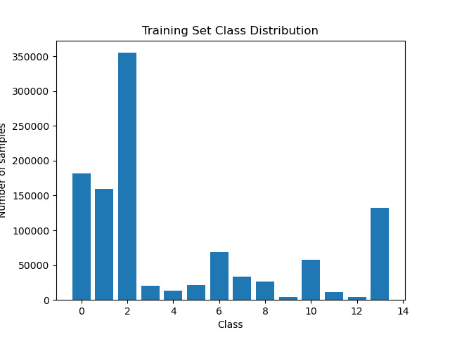
  <br>
  <em>S3DIS Dataset train distribution.</em>
</p>

### 2.1.3. Dales Dataset <a name="213-dales-dataset"></a>
The Dales Objects dataset is a Large Scale Benchmark Dataset for Segmentation and 
Instance Segmentation of Aerial Lidar data. It contains close to half-bilion hand labeled points and the dataset covers over 10 square kilometers. Each point also contains an intensity value. The dataset contains the following classes with the following number of points:

| Class Name  | Number of Points |
|-------------|------------------|
| Ground      | 246.9M           |
| Vegetation  | 159M             |
| Car         | 4.1M             |
| Truck       | 879k             |
| Powerline   | 994k             |
| Fence       | 2.1M             |
| Pole        | 262k             |
| Buildings   | 78.7M            |

If we attend to the number of points per class, we can see that the dataset is highly unbalanced. Most of the points belong to the 
classes ground and vegetation, while the classes truck, powerline, fence and pole have very few points in comparison, effectively making them part of a group called minority classes. Minority classes are more difficult to train and normally present lower convergence ratios. This is a problem
that we will try to address in this project.

The dataset is divided into 2 splits: train and test. The train split contains 58 .ply files, which consist of tiles of 500 x 500 meters and the test split contains 22 .ply files.

Each tile contains around 12M points. This is a very large number of points and it is not feasible to train a model with all
the points at once. First of all, we might not have enough GPU memory to store all the points, we would have to downsample the points
heavily and we would lose a lot of information. For these reasons we decided to partition the tiles into smaller tiles.

The partitiong of the tiles also depends in an overlap parameter [0-1], which determines how much overlap there is between the tiles
to ensure that the objects are not cut. Partitioning these large point clouds takes very long CPU time. We have devided a tile into
chunks so that each core of the CPU can process a chunk in parallel and store the information in a file. This way the process takes considerably less time.

The partitioning is part of the class Dataset, where if the dataset with a certain partition parameter and overlap is not found in 
disk, then it will create it and store it in disk. Every time the client calls the method getitem, then the dataset will load from disk the file of the particular partition for the given index and will return the points and the labels.

**Inference Results**

Some inference results are displayed below which demonstrate excellent performance.

<p align="center">
  
  <br>
  <em>Figure <number>: DALES dataset inference on 3 x 3 partitions. Tile measurements, roughly 200 units.</em>
</p>

<p align="center">
  
  <br>
  <em>Figure <number>: DALES dataset inference on 20 x 20 partitions. Tile measurements, roughly 30 units.</em>
</p>

#### Images of the partitions

### 2.2. Models <a name="22-models"></a>

#### 2.2.1. PointNet <a name="221-pointnet"></a>

<p align="center">
  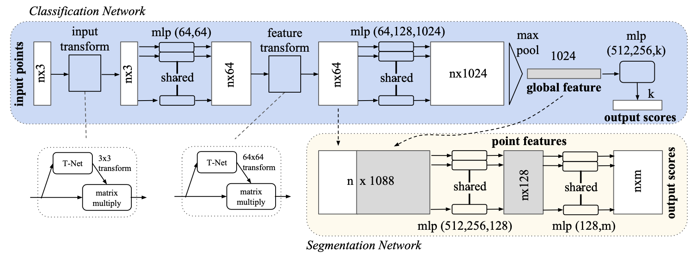
  <br>
  <em>PointNet architecture.</em>
</p>

#### 2.2.2. PointNet++ <a name="222-pointnetpp"></a>

<p align="center">
  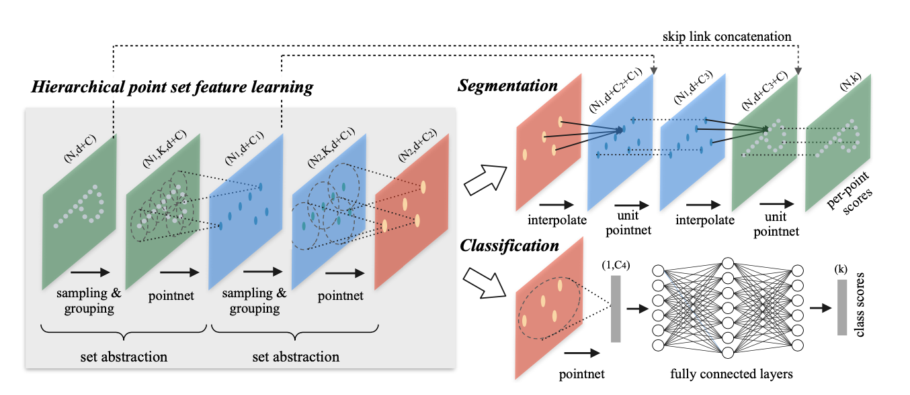
  <br>
  <em>PointNet++ architecture.</em>
</p>

### 2.3. Sampling <a name="23-sampling"></a>

#### 2.3.1. Normalization <a name="231-normalization"></a>

Normalization is often the first step in processing point cloud data. It involves adjusting the values of the points so that they fall within a specific range, typically between 0 and 1. This is done using min/max normalization, which scales the points based on the minimum and maximum values along each axis.

<p align="center">
  
  <br>
  <em>Figure <number>: Comparison between a point cloud not normalized (left) and normalized (right).</em>
</p>

#### 2.3.2. Random Downsampling <a name="232-normalization"></a>

Random downsampling is the most straightforward technique. It involves randomly selecting a subset of points from the original point cloud. This method is all about speed and simplicity.

- Advantages: It is incredibly easy to implement and runs very quickly. It is a great choice when reducing a dataset size. By randomly sampling points, this technique reduces the dataset uniformly, which can be useful if the point cloud presents a relatively homogeneous distribution.
- Disadvantages: Possible loss of details and features since the selection process is entirely random. By not considering the spatial arrangement between the points, it may lead to not gathering relevant geometric information or relationships, which can be problematic for more complex datasets. 

Given a point cloud $P = \{p_1, p_2, \ldots, p_N\}$, where $N$ is the total number of points, the goal of random downsampling is to select a subset $P' \subset P$ such that $|P'| = M$ where $M < N$.

The process can be described as:

1. **Random Selection:**

    Generate a random sample of indices $S$ of size $M$ from the set $(1, 2, \ldots, N)$ without replacement.
    
    $$S = \{i_1, i_2, \ldots, i_M\} \quad \text{where} \quad i_j \in \{1, 2, \ldots, N\} \quad \text{and} \quad |S| = M$$

2. **Downsampled Point Cloud:**

    Construct the downsampled point cloud $P'$ using the indices $S$.
    
    $$P' = \{p_{i_1}, p_{i_2}, \ldots, p_{i_M}\}$$


<p align="center">
  
  <br>
  <em>Figure <number>: Comparison between different random sampling rates.</em>
</p>


#### 2.3.3. Voxel Grid Downsampling <a name="233-voxel grid"></a>

### Voxel Grid Downsampling

Voxel grid downsampling divides the point cloud into a 3D grid of small cubes, also called voxels. Within each voxel, points are averaged to create a single representative point. The voxel size can be modified in order to adjust the density in the output point cloud. This method reduces the number of points while preserving to some extent the spatial structure of the data, it also helps in reducing noise and computational complexity.

The voxel size is a critical parameter in this process, as it directly influences the level of detail and accuracy of the downsampled point cloud. A larger voxel size results in greater reduction of data, which can speed up computations and reduce storage requirements but may lead to loss of important details and structures. Similarly, a smaller voxel size retains more details but offers less reduction in the number of points, maintaining higher computational complexity and storage demands.

Given a point cloud and a voxel size $v$:

1. **Voxelization:**

    Compute the voxel index for each point $p_i = (x_i, y_i, z_i)$:

    $$\text{voxel index}(p_i) = \left( \left\lfloor \frac{x_i}{v} \right\rfloor, \left\lfloor \frac{y_i}{v} \right\rfloor, \left\lfloor \frac{z_i}{v} \right\rfloor \right)$$


2. **Averaging:**

    For each voxel, compute the centroid of the points within that voxel:

    $$p_{\text{centroid}} = \frac{1}{|V_k|} \sum_{p \in V_k}p$$

    where $V_k$ is the set of points in the $k$-th voxel.

3. **Downsampled Point Cloud:**

    The downsampled point cloud $P'$ is the set of centroids of all non-empty voxels:

    $$P' ={p_{\text{centroid}1}, p_{\text{centroid}_2}, \ldots, p_{\text{centroid}_M}}$$

To illustrate the impact of voxel size on the point cloud, consider the following visualizations:

- No Sampling: The original point cloud with all data points intact.
<p align="center">
  
  <br>
  <em>Figure <number>: DALES dataset point cloud with no sampling performed.</em>
</p>

- Voxel Size of 20: A coarse downsampling with significant reduction in points, possibly losing fine details.
- Voxel Size of 10: Moderate downsampling, balancing detail and reduction.

<p align="center">
  
  <br>
  <em>Figure <number>: DALES dataset point cloud with voxel size 20 (left) and voxel size 10 (right).</em>
</p>

- Voxel Size of 5: Smaller downsampling, retaining more details while still reducing points.
- Voxel Size of 2: Very fine downsampling, closely resembling the original point cloud with minimal reduction.

<p align="center">
  
  <br>
  <em>Figure <number>: DALES dataset point cloud with voxel size 5 (left) and voxel size 2 (right).</em>
</p>

These visualizations demonstrate how adjusting the voxel size can help achieve the desired balance between data reduction and detail preservation.

It is important to note that this point cloud was not normalized and had a square longitude of around 60 units. The voxel sizes used in the visualizations are therefore relative to this specific scale. When training a model, the voxel size parameter must be carefully selected. One approach is to experiment with different voxel sizes during visualization and adjust accordingly to match the normalized point cloud, this is the method that we have followed on our project. Alternatively, a better approach could be to adjust the voxel size, perform the downsampling, and then normalize the point cloud before training.

#### 2.3.4. Inverse Planar-Aware Downsampling <a name="234-inverse-planar"></a>
Inverse planar-aware downsampling reduces the density of points in planar regions while preserving the density in non-planar regions, thus aiming to maintain complex features while hollowing out planar regions. In this way it can retain more relevant information about a point cloud with a lower amount of points, making it more effective in terms of computational cost. 

This method uses clustering and Principal Component Analysis (PCA) to identify planar areas and adjust the downsampling rate accordingly. It ensures that important structural details are preserved by selectively retaining points based on their spatial characteristics.

1. **Clustering:**

    apply DBSCAN clustering to the point cloud. DBSCAN (Density-Based Spatial Clustering of Applications with Noise) is a density-based clustering algorithm that groups together points that are closely packed together, and it marks points that are in low-density regions as outliers.

    $$clustering = \text{DBSCAN}(\epsilon = \text{plane threshold}, \text{min samples} = 10).fit(P)$$

    DBSCAN Parameters:

    - $ϵ$ : The maximum distance between two points to be considered as neighbors.
    - $min samples$: The minimum number of points to form a dense region.

Mathematically, for a point $p$ in the dataset $P$:
    $$clustering = \text{DBSCAN}(\epsilon = \text{plane\_threshold}, \text{min\_samples} = 10).fit(P)$$

$$Neighborhood(p)={q∈P∣∥p−q∥≤ϵ}Neighborhood(p)={q∈P∣∥p−q∥≤ϵ}$$


2. **Principal Component Analysis on Clusters**

For each cluster identified by DBSCAN (excluding noise points, ``label=−1``), PCA is applied to determine the planarity of the points. PCA decomposes the points in the cluster into orthogonal components, ordered by the amount of variance they explain:

Given a set of points in a cluster $X∈Rn×3X∈Rn×3$, PCA finds the principal components $V$ and the corresponding eigenvalues $λ$:

$$X⊤XV=VΛ$$

Where $Λ=diag(λ1,λ2,λ3)$

The explained variance ratio is:

$$Explained Variance Ratio=(λ1∑λ,λ2∑λ,λ3∑λ)$$


3. **Identifying Planar Points**

To determine if a point is in a planar region, we look at its distance from the principal plane, which is the plane formed by the first two principal components.


The distance $di$​ of a point $xi$​ from the principal plane (third principal component) is:

$$di=∣xi⋅v3∣$$

Where $v3$​ is the third principal component vector.

Points with distances below a certain threshold are considered planar. This threshold is determined by a percentile (a value between 0 and 1), in our case we used 0.95.

4. **Downsampling Based on Planarity**

Once planar and non-planar points are identified within each cluster, different downsampling rates are applied.

For planar points, the downsampling rate is adjusted based on the third principal component's explained variance $EV3$​:

$$Planar Downsampling Rate=lower downsamplerate×EV3​$$

For non-planar points, the downsampling rate is adjusted based on the inverse of the third principal component's explained variance:

$$Non-Planar Downsampling Rate=higherdownsamplerate×(1−EV3)$$
5. **Sampling Points**

Planar Points:
Number of points to sample from planar regions:

$$nplanar=max⁡(1,⌊Nplanar×Planar Downsampling Rate⌋)$$

Where $Nplanar$​ is the number of planar points in the cluster.

Non-Planar Points:
Number of points to sample from non-planar regions:

$$nonplanar=max⁡(1,⌊nonplanar×Non-Planar Downsampling Rate⌋)$$

Where $nonplanar​$ is the number of non-planar points in the cluster.

6. **Handling Noise Points**

Noise points, those not belonging to any cluster ``(label=−1)``, are sampled separately with a higher downsample rate:

$$noise=max⁡(1,⌊Nnoise×higherdownsamplerate⌋)$$

Where $Nnoise$​ is the number of noise points.

#### 2.3.5. Combined Downsampling <a name="235-combined"></a>

The combined downsampling algorithm integrates both, voxel grid and planar aware  downsampling algorithms to achieve a balanced reduction of a point cloud, preserving critical geometric details and addressing class imbalances. The methods used include voxel grid downsampling, inverse planar-aware downsampling. This approach ensures that irrelevant points are removed while important features and minority classes are retained.

1. **Overall Benefits of Combined Downsampling**

Voxel grid downsampling effectively reduces the number of redundant points in large, uniform regions.Inverse planar-aware downsampling further reduces points in planar areas while preserving non-planar details effectively hollowing out planar surfaces which account for roughly 60 to 80% of all points in each partition.

2. **Addressing Class Imbalance**

The combined approach helps maintain a better balance by ensuring that minority classes (e.g. poles, electric lines, cars) are better represented.
Planar regions like ground and buildings, which form the majority of points, are aggressively downsampled, reducing their dominance in the point cloud.

<p align="center">
  
  <br>
  <em>Figure <number>: Comparison of the combined downsampling algorithm vs no sampling.</em>
</p>

The combined downsampling algorithm effectively reduces redundant points and retains important geometric features in point clouds. By adjusting plane threshold and voxel size, it balances the representation of majority (e.g., ground, buildings) and minority classes (e.g., poles, cars). The left image (plane threshold: 20, voxel size: 5) preserves finer details, while the right image (plane threshold: 40, voxel size: 10) more aggressively reduces planar regions. 

<p align="center">
  
  <br>
  <em>Figure <number>: Comparison of the combined downsampling algorithm with different parameters.</em>
</p>

### 2.4. Experiments <a name="24-experiments"></a>

#### 2.4.1. Experiment metrics and logging <a name="241-experiment-logging"></a>
We have conducted different experiments using different models and hyperparameters. We decided to log the metrics of every 
experiment in Mlflow because it is a widely used open source application that can help us keep track of the experiments, understand
the results and better choose the hyperparameters.

The Mlflow server was running in a Google Cloud instance so that every member of the team can access to it from any machine.
In order to run the mlflow server in the Google Cloud instance, the machine needs to have docker installed. After installing docker, 
the Mlflow application can be run like this:
```bash
docker run -it --name mlflow -p <host_port>:5000 -v <mlruns_host_path>:/mlruns -v <mlartifacts_host_path>:/mlartifacts ghcr.io/mlflow/mlflow:v2.13.0 mlflow ui --host 0.0.0.0
```
To access from any other machine via http, we have to change the firewall rules of the virtual machine in Google Cloud so that the port is exposed to the internet. Further work should involve changing the security of the communication to https.

<p align="center">
  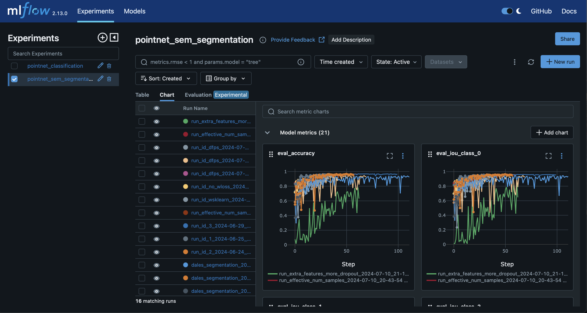
  <br>
  <em>Mlflow server.</em>
</p>

For this experiment we have logged the following metrics:

**Classification task**:
- train_loss
- eval_loss
- train_mean_accuracy
- eval_mean_accuracy
- train_per_class_loss
- eval_per_class_loss

**Segmentation task**:
- train_loss
- eval_loss
- train_accuracy
- eval_accuracy
- train_per_class_iou
- eval_per_class_iou

The accuracy is computed as follow:

$$\text{Accuracy}=\frac{\sum_{i=1}^{N} \mathbb{I}(y_i = \hat{y}_i)}{N}=\frac{\text{Number of correct predictions}}{\text{Total number of predictions}}
$$

The per class IoU is computed as follow:

$$\text{IoU} = \frac{\text{True Positives}}{\text{True Positives} + \text{False Positives} + \text{False Negatives}}
$$

As for losses we have used the following:
1. Classification loss: CrossEntropyLoss with label smoothing, focal loss and regularization.

$$\text{loss} = \left(1 - p_n\right)^\gamma \cdot \text{ceLoss}$$

- CrossEntropyLoss:

$$\text{ceLoss} = -\sum_{i=1}^{C} y_i \log(p_i)$$
- Label Smoothing:

$$y_i' = (1 - \epsilon) y_i + \frac{\epsilon}{C}$$

<p align="center">
  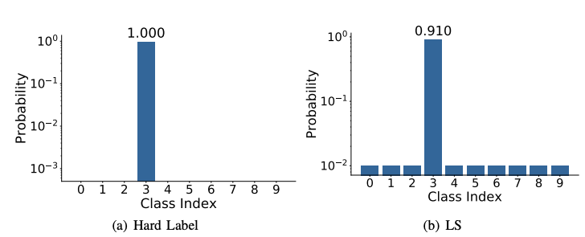
  <br>
  <em>Label smoothing.</em>
</p>

- Focal loss:
The intuition behind focal loss is to reduce the loss contribution of well-classified examples. So that the model focuses on the hard examples:

$$\text{loss} = (1 - p_n)^\gamma \cdot \text{ceLoss}$$

- Regularization term:

$$\text{reg} = \frac{\text{regularizationWeight}}{N} \cdot \| I - F F^\top \|_F$$

2. The segmentation loss is also Cross Entropy Loss of the points with label smoothing,
focal loss adding also a Dice loss term. The Dice loss is computed as follows:
This is a loss term used for semantic segmentation in datasets that are highly unbalanced. The
dice coefficient enlarges the weight of overlap both in the denominator and numerator.

$$\text{DiceLoss} = 1 - \frac{2 \cdot (\text{top} + \epsilon)}{\text{bot} + \epsilon}$$

- Weighted loss:
The weight applied to each class depends on the number of samples we have of that class. The idea is to penalize more the minority classes so that the model learns to classify them better. We have implemented the weights firstly using the method of Sklearn **compute_class_weights**, which by default computes the weights as follow:

$$\text{classWeight} = \frac{\text{nSamples}}{\text{nClasses} \times \text{nSamplesPerClass}}$$

Once the weight per class is computed, the weighted loss is computed as follows:

$$\text{WeightedLoss} = \frac{1}{N} \sum_{i=1}^{N} w_i \cdot \text{Loss}(y_i, \hat{y}_i)$$

- Effective number of samples weighted loss:
This is a weighted loss where the weight applied to each class based on its
frequency depends on a particular formula:

$$\text{effectiveNum} = \frac{1.0 - \beta^{counts}}{1.0 - \beta}$$

$$\text{labelWeights} = \frac{1}{\text{effectiveNum}}$$

We have also logged **system metrics** which some of them are:
- System memory usage
- GPU memory usage
- CPU utilization percentage

And other information that is helpful for us:
- A checkpoint of the best model so far in the format .pth
- A plot with train and eval classes distribution
- The command the script was run
- The arguments the train was created with for reproducibility 

#### 2.4.2. Experiments with S3Dis PointNet semantic segmentation <a name="242-experiments-s3dis-pointnet"></a>

**Experiment PointNet with base hyper parameters:**
**Hypothesis:**
- The model should be able to learn the classes of the S3DIS dataset with the base parameters.
**Experiment Setup:**
- PointNet is trained in the S3Dis dataset.
**Results:**
<p align="center">
  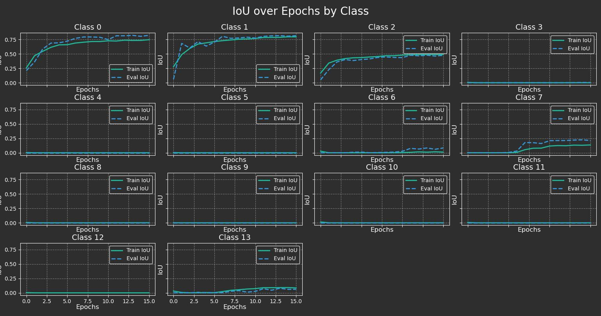
  <br>
  <em>IoU by Class without weighted loss.</em>
</p>

**Conclusions:**
- The model is able to learn the classes that have the higher number of points. PointNet struggles
to classify points of classes with a low number of points such as class 4, 5, 9, etc. This figure and
the figure that shows the data distribution of the train data shows a correlation.

**Experiment PointNet with Weighted Loss:**
**Hypothesis:**
- The idea behing the weighted loss is to penalize more the minority classes so that the model
learns to classify them better.
**Results:**
<p align="center">
  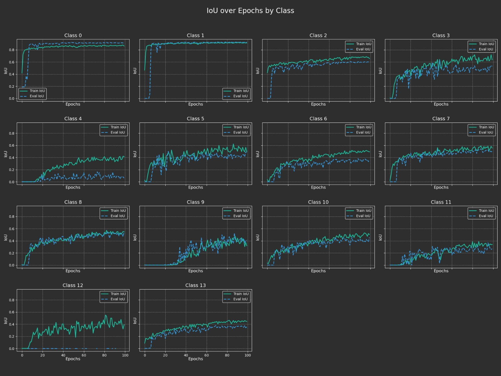
  <br>
  <em>IoU by Class with weighted loss.</em>
</p>

**Conclusions:**
- With weighted loss, the plot shows that PointNet is actually learning to classify minority classes.
This is a huge improvement over the previous experiment.

#### 2.4.3. Experiments with Dales PointNet++ semantic segmentation <a name="243-experiments-dales-pointnetpp"></a>

Experiment template
**Experiment Name:**
- Params table
**Hypothesis:**
- Describe the hypothesis here.
**Experiment Setup:**
- Describe the experiment setup here.
**Results:**
- Describe the results here.
**Conclusions:**
- Describe the conclusions here.

**Experiment Base Hyper Parameters:**
| Learning Rate | Optimizer | Batch Size | Num Points | Grouping Method | Dropout | Scheduler | Label Smoothing | Extra Feature Dropout |
|---------------|-----------|------------|------------|-----------------|---------|-----------|------------------|-----------------------|
| 0.001         | AdamW     | 8          | 8192       | MSG             | 0.5     | Cosine    | 0.1              | 0.2                   |

Other parameters:
- Partitions: 20
- Overlap: 0.1
- Use extra features: true
- Weight type: None

**Hypothesis:**
- Parameters very similar to the ones used in the papers. Adding dropout to extra features to avoid overfitting to the intensity
value of the data. As in the model could learn to create a map between intensity and semantic segmentation as in any point 
that is green could be classified as vegetation. We want to avoid that and make the model pay attention to geometrical features too.

**Experiment Setup**
Experiment using PointNet++ and the Dales Dataset.

**Results:**
- We show a comparison between the train and evaluation loss, accuracy and IoU to
understand if the model is overfitting or not and how good it is performing with each class.

<div style="display: flex; justify-content: center;">
  <div style="flex: 50%; padding: 10px;">
    <p align="center">
      
      <br>
      <em>Loss.</em>
    </p>
  </div>
  <div style="flex: 50%; padding: 10px;">
    <p align="center">
      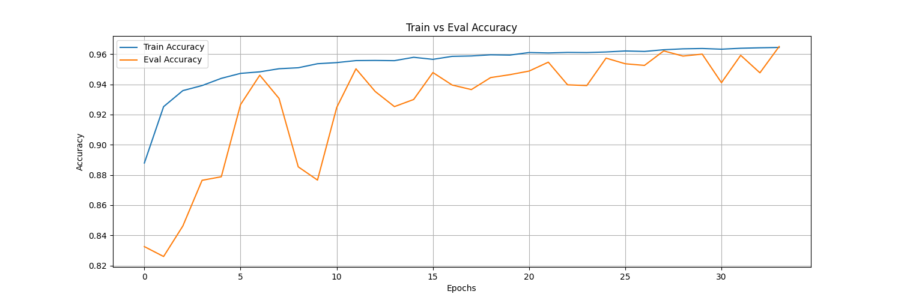
      <br>
      <em>Accuracy.</em>
    </p>
  </div>
</div>

<p align="center">
  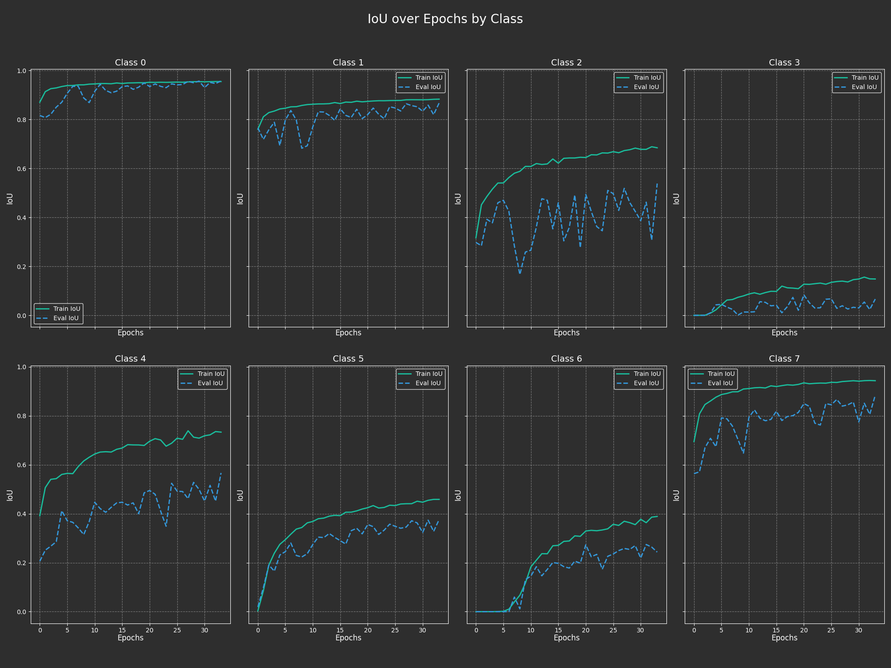
  <br>
  <em>IoU.</em>
</p>

**Conclusions:**
- The model does not seem to overfit, both train and evaluation loss are decreassing
until the steabilize. Finally, we can see that there are certain classes that the model
is not able to classify well, like class 3, 5 and 6. These classes are the ones with the
least number of points in the dataset.

**Experiment Increased Batch size and used SSG:**

| Learning Rate | Optimizer | Batch Size | Num Points | Grouping Method | Dropout | Scheduler | Label Smoothing | Extra Feature Dropout |
|---------------|-----------|------------|------------|-----------------|---------|-----------|------------------|-----------------------|
| 0.001         | AdamW     | 16          | 8192       | SSG             | 0.5     | Cosine    | 0.1              | 0.2                   |

Other parameters:
- Partitions: 20
- Overlap: 0.1
- Use extra features: true
- Weight type: None

**Hypothesis:**
- Increasing the batch size should make the train faster because we are using more data at
once. Single Scale Grouping should make the model learn worse with datasets where the density of points is not uniform.
We would like to confirm this.

**Experiment Setup**
- Experiment using PointNet++ with Single Scale Grouping training with Dales Dataset. We have implemented the training script so that
to change between SSG and MSG it is just changing a parameter.

**Results:**

<div style="display: flex; justify-content: center;">
  <div style="flex: 50%; padding: 10px;">
    <p align="center">
      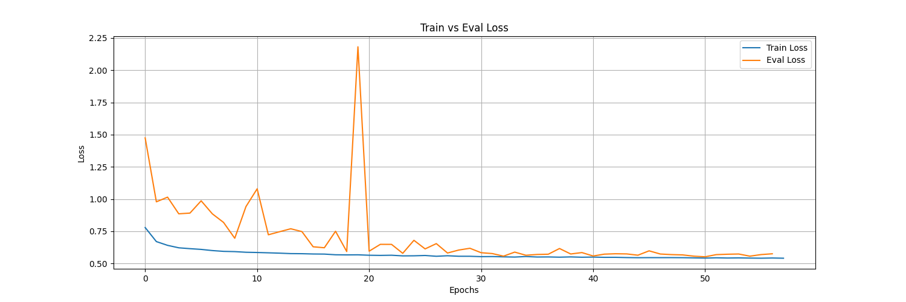
      <br>
      <em>Loss.</em>
    </p>
  </div>
  <div style="flex: 50%; padding: 10px;">
    <p align="center">
      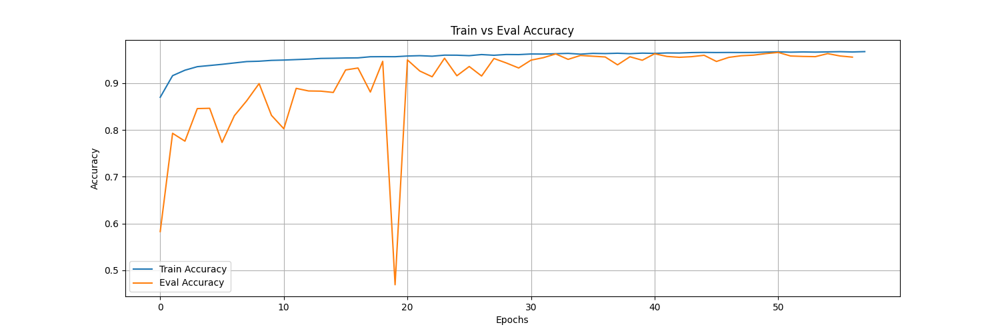
      <br>
      <em>Accuracy.</em>
    </p>
  </div>
</div>

<p align="center">
  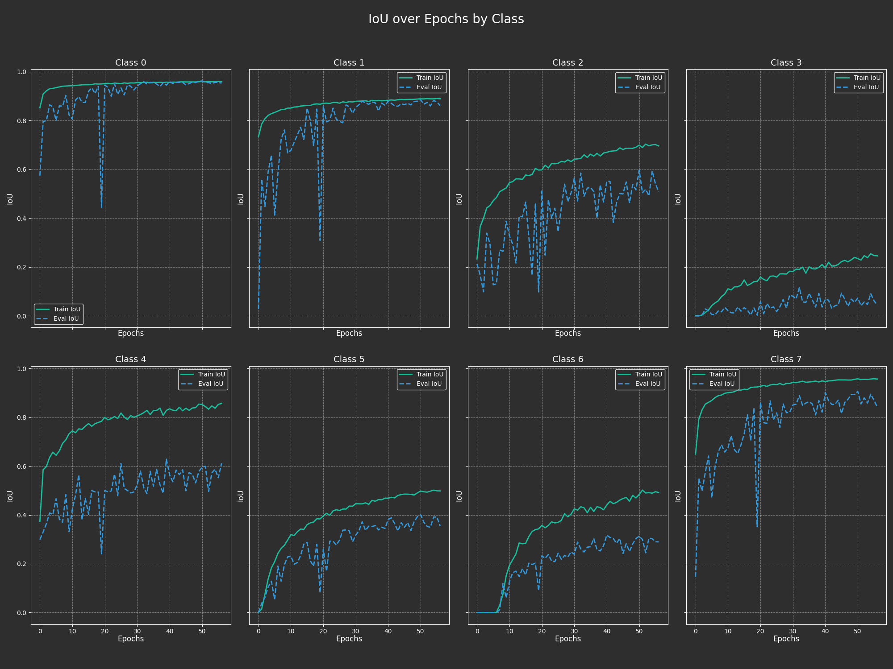
  <br>
  <em>IoU.</em>
</p>

**Conclusions:**
- The results seem quite similar to the previous experiment. Perhaps there is not much difference between MSG and SSG for this
particular dataset or we can not appreciate the difference because of the number of points used, downsampling, etc.

**Experiment Decreased Number of Points**
| Learning Rate | Optimizer | Batch Size | Num Points | Grouping Method | Dropout | Scheduler | Label Smoothing | Extra Feature Dropout |
|---------------|-----------|------------|------------|-----------------|---------|-----------|------------------|-----------------------|
| 0.001         | AdamW     | 8          | 4096       | MSG             | 0.5     | Cosine    | 0.1              | 0.2                   |

Other parameters:
- Partitions: 20
- Overlap: 0.1
- Use extra features: true
- Weight type: None

**Hypothesis:**
- By decreasing the number of points, perhaps the model is able to pay more attention to
very small objects or very local features. However, decreasing the number of points also
means that the first random downsampling of the points will eliminate more information.
We also want to know how much this parameter affects the performance of the model.

**Experiment Setup**
- PointNet++ trained with Dales. Decreasing the number of points is changing an argument to the training script.
This will increase the downsample that we do to the raw point cloud to the one that we input to the model. This 
downsample is done with random sampling.

**Results:**

<div style="display: flex; justify-content: center;">
  <div style="flex: 50%; padding: 10px;">
    <p align="center">
      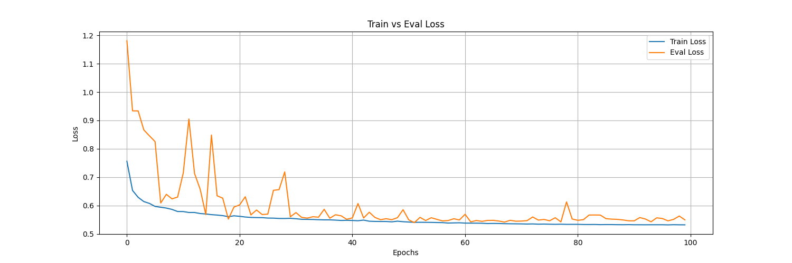
      <br>
      <em>Loss.</em>
    </p>
  </div>
  <div style="flex: 50%; padding: 10px;">
    <p align="center">
      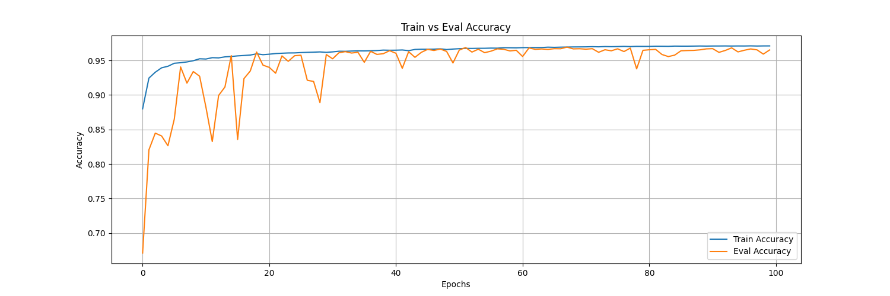
      <br>
      <em>Accuracy.</em>
    </p>
  </div>
</div>

<p align="center">
  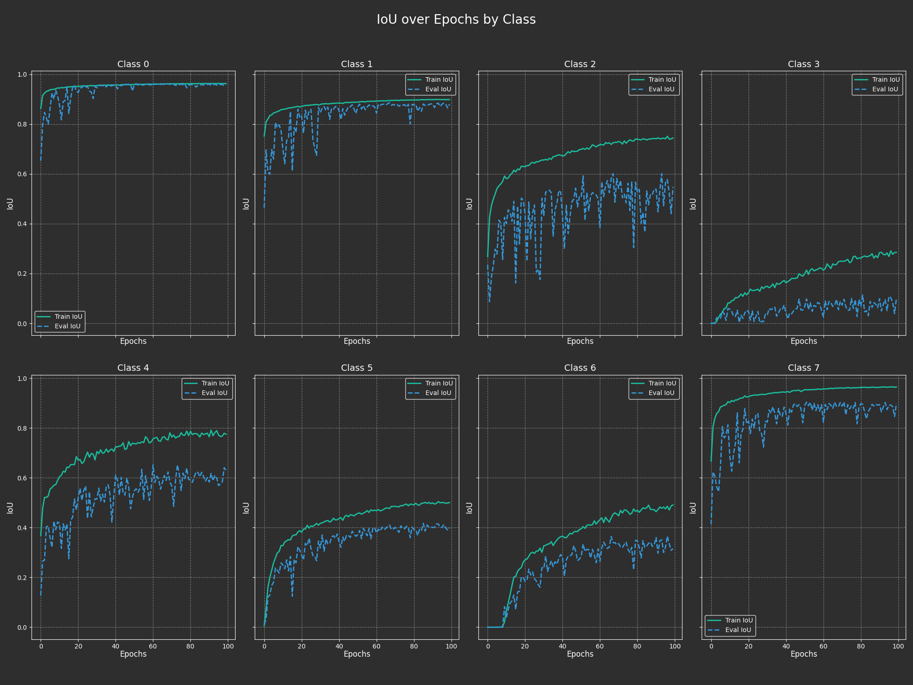
  <br>
  <em>IoU.</em>
</p>

**Conclusions:**
- The results seem quite similar to the previous experiment, where the model still struggles
to classify the classes with the least number of points.

**Experiment Effective Number of Samples**
| Learning Rate | Optimizer | Batch Size | Num Points | Grouping Method | Dropout | Scheduler | Label Smoothing | Extra Feature Dropout |
|---------------|-----------|------------|------------|-----------------|---------|-----------|------------------|-----------------------|
| 0.001         | AdamW     | 16          | 8192       | MSG             | 0.5     | Cosine    | 0.0              | 0.2                   |

Other parameters:
- Partitions: 20
- Overlap: 0.1
- Use extra features: true
- Weight type: EffectiveNumSamples
- ens_beta: 0.99999

**Hypothesis:**
- Effective Number of Samples is a technique to deal with unbalanced datasets. The
idea is to give more weight to the minority classes so that the model pays more
attention to them following a specific formula.

**Experiment Setup**
- We have implemented the Effective Number of Samples formula given the class balance of the dataset. This experiment is done
with the Dales dataset and PointNet++.

**Results:**

<div style="display: flex; justify-content: center;">
  <div style="flex: 50%; padding: 10px;">
    <p align="center">
      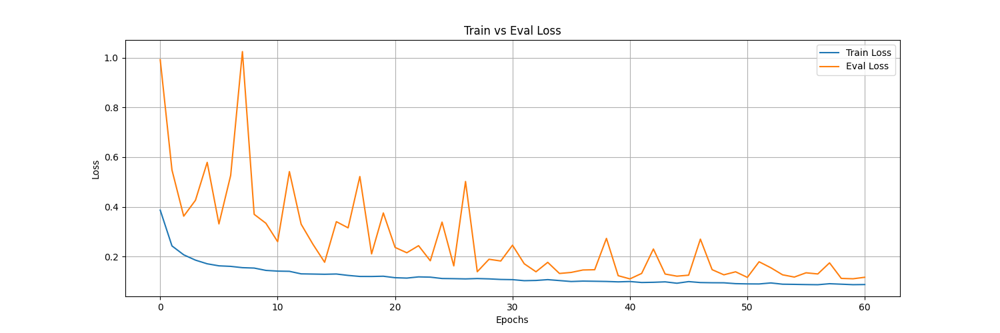
      <br>
      <em>Loss.</em>
    </p>
  </div>
  <div style="flex: 50%; padding: 10px;">
    <p align="center">
      
      <br>
      <em>Accuracy.</em>
    </p>
  </div>
</div>

<p align="center">
  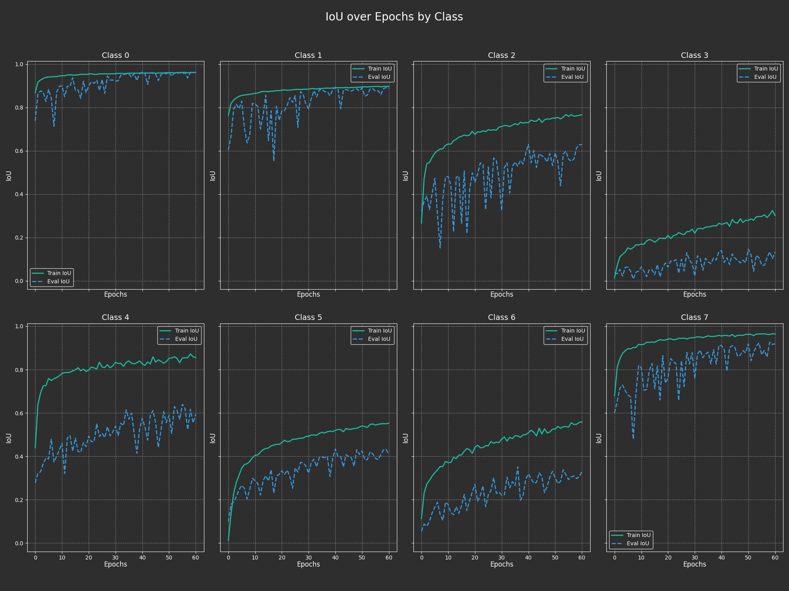
  <br>
  <em>IoU.</em>
</p>

**Conclusions:**
- It has taken fewer epochs for the model to start learning underrepresented classes. We can
see this in class 3 and 6 by comparing with previous experiments. However, after a while,
the results are similar to the previous experiments, but the evaluation IoU of this experiment is tending to increase, so perhaps with longer training, the results regarding
minority classes could be better.

**Experiment Weighted Loss**
| Learning Rate | Optimizer | Batch Size | Num Points | Grouping Method | Dropout | Scheduler | Label Smoothing | Extra Feature Dropout |
|---------------|-----------|------------|------------|-----------------|---------|-----------|------------------|-----------------------|
| 0.001         | AdamW     | 16          | 8192       | MSG             | 0.5     | Cosine    | 0.0              | 0.2                   |

Other parameters:
- Partitions: 20
- Overlap: 0.1
- Use extra features: true
- Weight type: Sklearn

**Hypothesis:**
- Same as the previous experiment, we expect that weighting the loss will help the model
to pay more attention to the minority classes.

**Experiment Setup**
- We have implemented the Weighted Loss using Sklearn. This experiment is done with the Dales dataset and PointNet++.

**Results:**

<div style="display: flex; justify-content: center;">
  <div style="flex: 50%; padding: 10px;">
    <p align="center">
      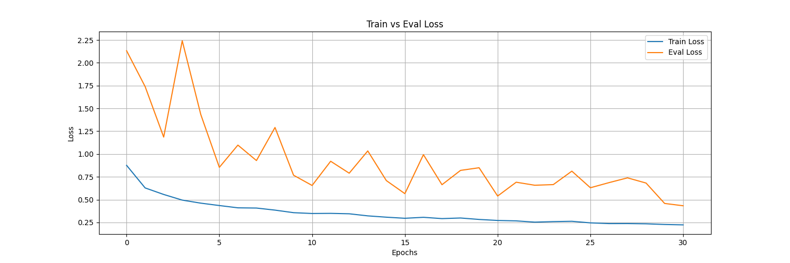
      <br>
      <em>Loss.</em>
    </p>
  </div>
  <div style="flex: 50%; padding: 10px;">
    <p align="center">
      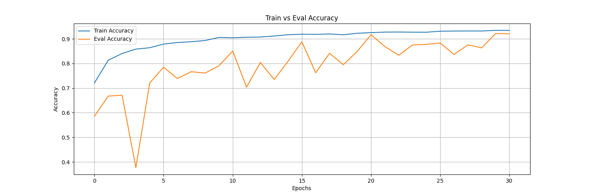
      <br>
      <em>Accuracy.</em>
    </p>
  </div>
</div>

<p align="center">
  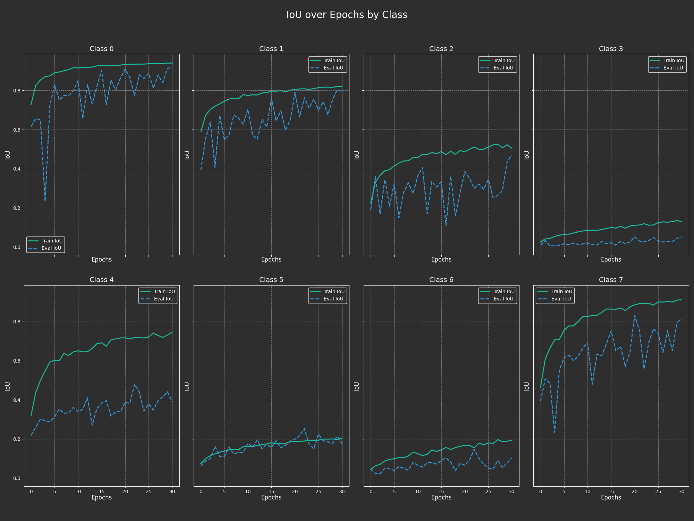
  <br>
  <em>IoU.</em>
</p>

**Conclusions:**
- The model still struggles with the minority classes and comparing this experiment with
using Effective Number of Samples, ENS seems to get better results.

**Experiment No Weighted Loss or Label Smoothing**
- With this experiment we expect to see that because the dataset is highly unbalanced, the
model will not be able to learn the minority classes well.

| Learning Rate | Optimizer | Batch Size | Num Points | Grouping Method | Dropout | Scheduler | Label Smoothing | Extra Feature Dropout |
|---------------|-----------|------------|------------|-----------------|---------|-----------|------------------|-----------------------|
| 0.001         | AdamW     | 16          | 8192       | MSG             | 0.5     | Cosine    | 0.0              | 0.2                   |

Other parameters:
- Partitions: 20
- Overlap: 0.1
- Use extra features: true
- Weight type: None

**Experiment Setup**
- This experiment is done by changing parameters of the training script. Label loss to 0 and weighted loss to None.
PointNet++ is trained with the Dales dataset.

**Hypothesis:**

**Results:**
<div style="display: flex; justify-content: center;">
  <div style="flex: 50%; padding: 10px;">
    <p align="center">
      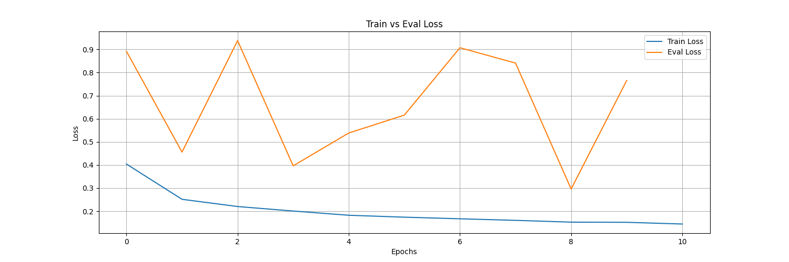
      <br>
      <em>Loss.</em>
    </p>
  </div>
  <div style="flex: 50%; padding: 10px;">
    <p align="center">
      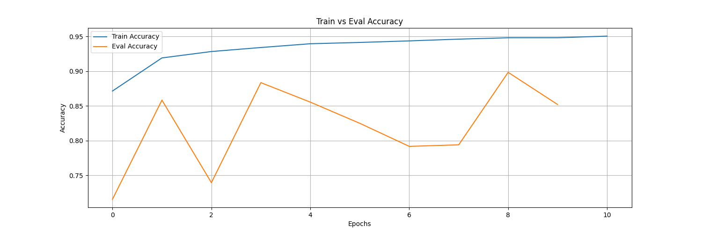
      <br>
      <em>Accuracy.</em>
    </p>
  </div>
</div>

<p align="center">
  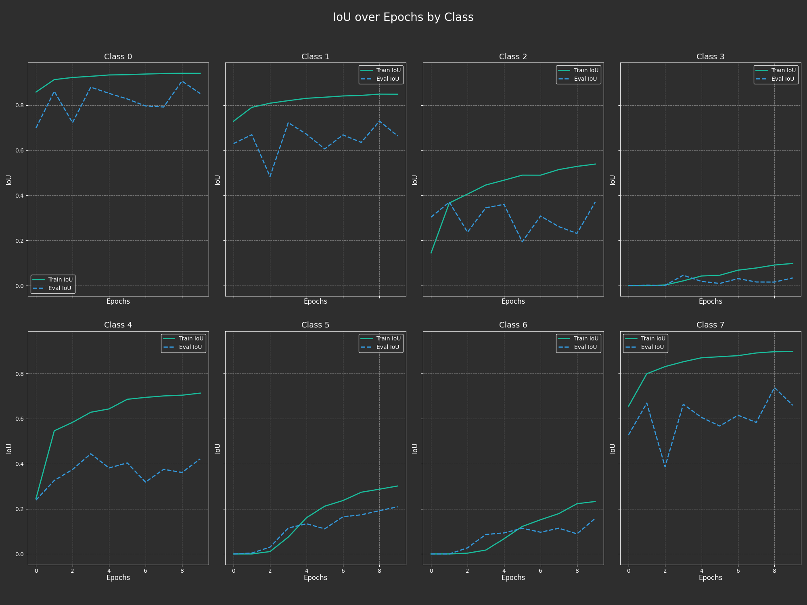
  <br>
  <em>IoU.</em>
</p>

**Conclusions**
- This training stopped too early to reach a conclusion. However, comparing the first 10 epochs of this experiment with previous ones, the evaluation loss is much more unstable.

**Experiment Dense Farthest Point Sampling**
| Learning Rate | Optimizer | Batch Size | Num Points | Grouping Method | Dropout | Scheduler | Label Smoothing | Extra Feature Dropout |
|---------------|-----------|------------|------------|-----------------|---------|-----------|------------------|-----------------------|
| 0.001         | AdamW     | 16          | 8192       | MSG             | 0.5     | Cosine    | 0.1              | 0.2                   |

Other parameters:
- Partitions: 10
- Overlap: 0.1
- Use extra features: true
- Weight type: None

**Hypothesis:**
- We hypothesize that incorporating a density-related farthest point sampling algorithm into the PointNet++ architecture will enhance its ability to capture local features, resulting in improved classification accuracy for point cloud data. Specifically, we expect the density-related sampling method to better represent the geometric distribution of the points, particularly in areas with varying densities, leading to better performance on classification tasks.

**Experiment Setup**
- PointNet++ Backbone: The core network architecture will be PointNet++, which builds on PointNet by adding hierarchical feature learning and local neighborhood information.
Sampling Algorithm: We will replace the traditional farthest point sampling (FPS) algorithm with the proposed density-related farthest point sampling (DFPS) algorithm.

**Results:**
<div style="display: flex; justify-content: center;">
  <div style="flex: 50%; padding: 10px;">
    <p align="center">
      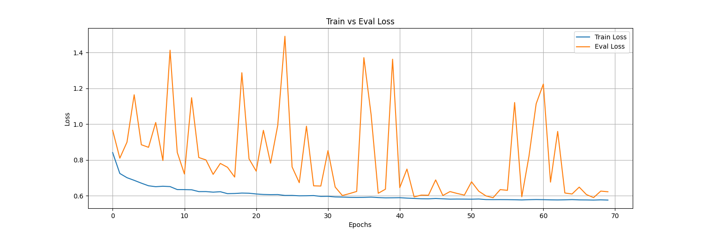
      <br>
      <em>Loss.</em>
    </p>
  </div>
  <div style="flex: 50%; padding: 10px;">
    <p align="center">
      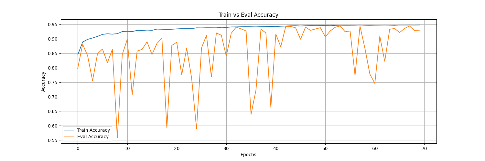
      <br>
      <em>Accuracy.</em>
    </p>
  </div>
</div>

<p align="center">
  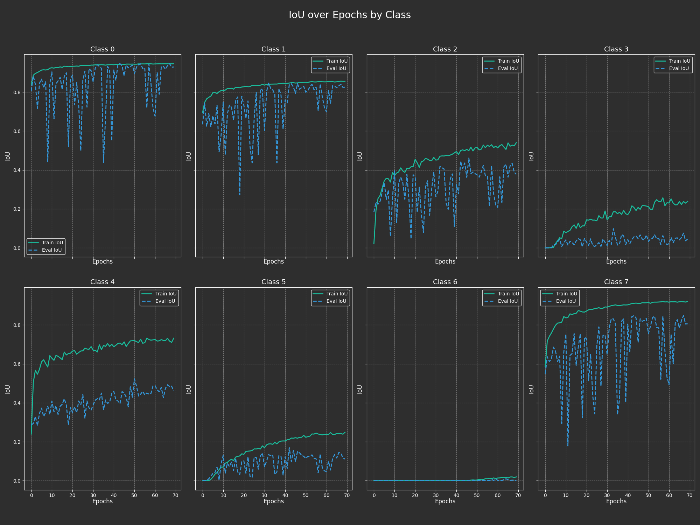
  <br>
  <em>IoU.</em>
</p>

**Conclusions**
- The implementation and principle of PointNet++ and proposes a density-dependent farthest point sampling algorithm by analyzing the limitations of the traditional farthest point sampling algorithm, solves them to a certain extent. However, the model seems to performe worsew will class 6. Perhaps the model needs more points.

**Experiment DFPS Increasing Number of Points**
| Learning Rate | Optimizer | Batch Size | Num Points | Grouping Method | Dropout | Scheduler | Label Smoothing | Extra Feature Dropout |
|---------------|-----------|------------|------------|-----------------|---------|-----------|------------------|-----------------------|
| 0.001         | AdamW     | 16          | 16000       | MSG             | 0.5     | Cosine    | 0.1              | 0.2                   |

Other parameters:
- Partitions: 10
- Overlap: 0.1
- Use extra features: true
- Weight type: None

**Hypothesis:**
- Increasing the number of points that we input to the model. We expect that because we
add more information to the model, it should be able to learn better.

**Experiment Setup**
- This is done just by changing the number of points parameter. By increasing the number of points, the downsample that we do to the raw point cloud is less agressive. PointNet++ is trained with the Dales Dataset. 

**Results:**
<div style="display: flex; justify-content: center;">
  <div style="flex: 50%; padding: 10px;">
    <p align="center">
      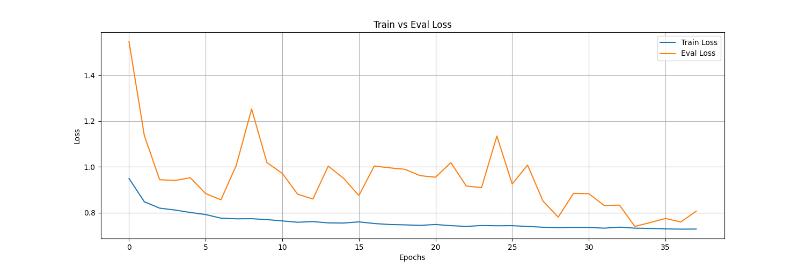
      <br>
      <em>Loss.</em>
    </p>
  </div>
  <div style="flex: 50%; padding: 10px;">
    <p align="center">
      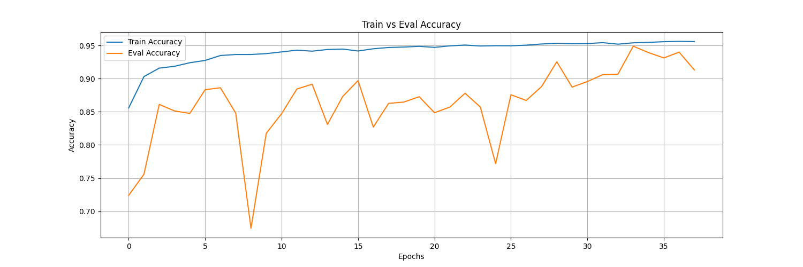
      <br>
      <em>Accuracy.</em>
    </p>
  </div>
</div>

<p align="center">
  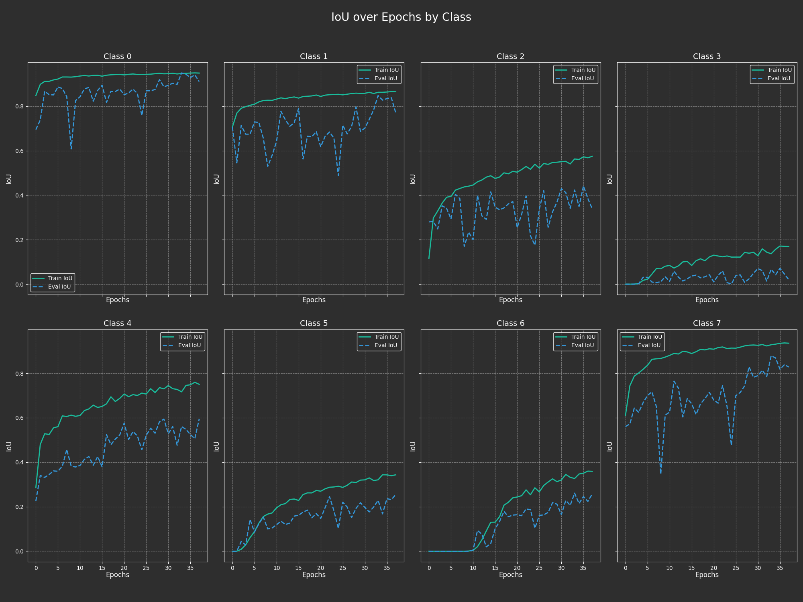
  <br>
  <em>IoU.</em>
</p>

**Conclusions**
- The evaluation loss and accuracy are much more stable than in the previous experiment.
Also, the model does better at learning the minority classes than in the pervious experiment. Adding more points has helped the model to learn better with DFPS. 

**Experiment More Dropout Extra Features, Weighted Loss**
| Learning Rate | Optimizer | Batch Size | Num Points | Grouping Method | Dropout | Scheduler | Label Smoothing | Extra Feature Dropout |
|---------------|-----------|------------|------------|-----------------|---------|-----------|------------------|-----------------------|
| 0.001         | AdamW     | 16          | 8192       | MSG             | 0.5     | Cosine    | 0.0              | 0.5                   |

Other parameters:
- Partitions: 10
- Overlap: 0.1
- Use extra features: true
- Weight type: Sklearn

**Hypothesis:**
- By adding more dropout to the extra features, we expect the model not to overfit to the
intensity signal of the data. Also we are using weighted loss as a last attempt to make the model learn the minority classes better.

**Experiment Setup**
- We changed the extra features dropout from 0.2 to 0.5 and we are using weighted loss. PointNet++ is trained with the Dales Dataset.
The extra features in this case is the intensity signal that the Dales dataset provides for each point. The points would have shape 4
(x,y,z, intensity).

**Results:**
<div style="display: flex; justify-content: center;">
  <div style="flex: 50%; padding: 10px;">
    <p align="center">
      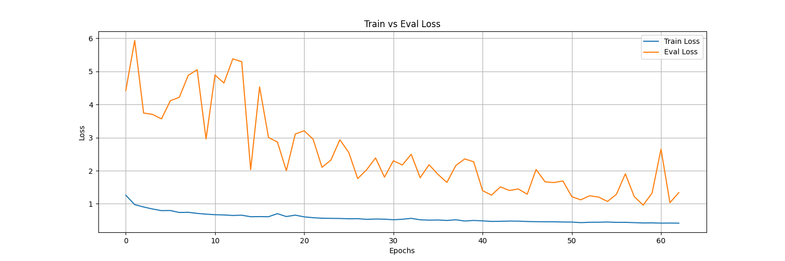
      <br>
      <em>Loss.</em>
    </p>
  </div>
  <div style="flex: 50%; padding: 10px;">
    <p align="center">
      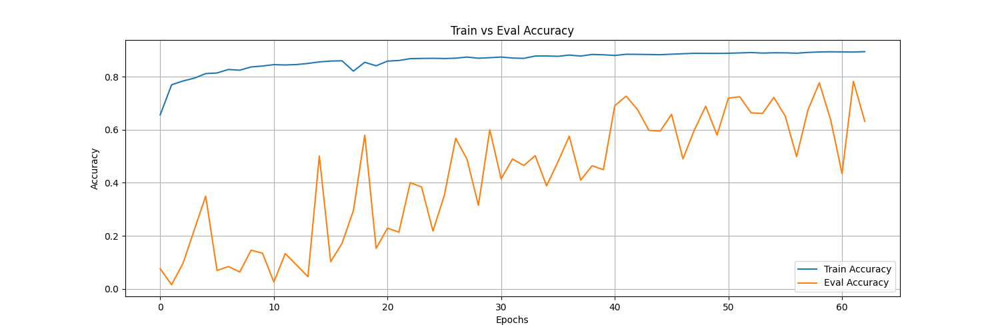
      <br>
      <em>Accuracy.</em>
    </p>
  </div>
</div>

<p align="center">
  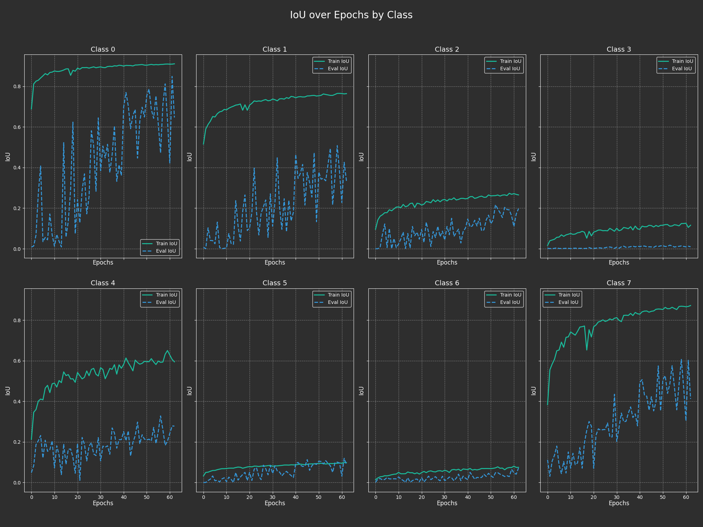
  <br>
  <em>IoU.</em>
</p>

**Conclusions**
- The evaluation accuracy has dropped considerably compared to previous experiments. Even
compared to the one where weighted loss was used. Perhaps this amount of dropout is too
much for this model and for this dataset in particular.

**Experiment Using PointNet with Dales**
| Learning Rate | Optimizer | Batch Size | Num Points | Grouping Method | Dropout | Scheduler | Label Smoothing | Extra Feature Dropout |
|---------------|-----------|------------|------------|-----------------|---------|-----------|------------------|-----------------------|
| 0.001         | AdamW     | 16          | 8192       | MSG             | 0.5     | Cosine    | 0.0              | 0.5                   |

Other parameters:
- Partitions: 10
- Overlap: 0.1
- Use extra features: false
- Weight type: None

**Hypothesis:**
- PointNet is much worse than PointNet++ in terms of extracting local features since PointNet++ adds
the hierarchical feature extractors. We expect that PointNet reaches a lower accuracy than PointNet++
in this experiment and would like to confirm it.

**Experiment Setup**
- Model PointNet is trained with the Dales dataset.

**Results:**
<div style="display: flex; justify-content: center;">
  <div style="flex: 50%; padding: 10px;">
    <p align="center">
      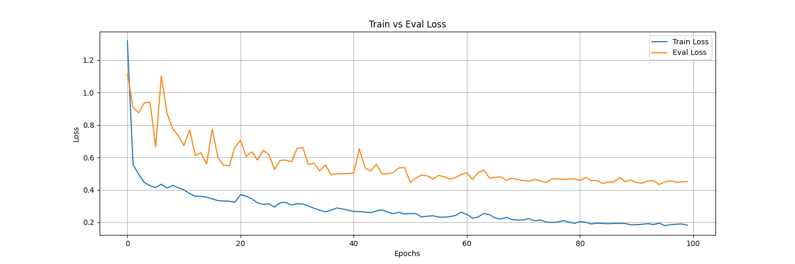
      <br>
      <em>Loss.</em>
    </p>
  </div>
  <div style="flex: 50%; padding: 10px;">
    <p align="center">
      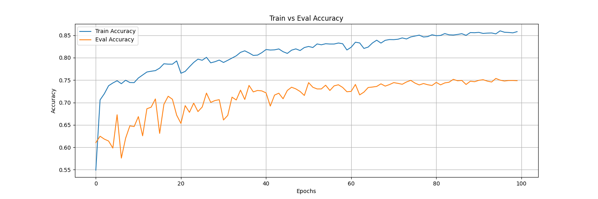
      <br>
      <em>Accuracy.</em>
    </p>
  </div>
</div>

<p align="center">
  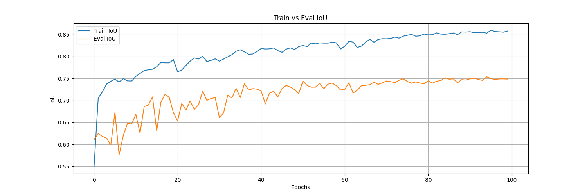
  <br>
  <em>IoU.</em>
</p>

**Conclusions**
- Compared to the previous experiments, PoinNet reaches considerably worse evaluation loss and accuracy
as it was expected. PointNet might be reasonably good for small objects without so much noise,
but PointNet++ is much better for large scenes.

## 3. How to run the code <a name="3-How-to-run-the-code"></a>

### 3.1. Installation <a name="31-installation"></a>
1. **Clone the Repository:**
```bash
git clone https://github.com/jeferal/point_net_suite.git
cd point_net_suite
```

2. **Install the dependencies**

#### Option 1: via pip and requirements.txt
If you are using a virtual environment or python environment within a docker container or
a python interpreter, you can clone and install the requirements with pip.
```bash
pip3 install -r requirements.txt
pip3 install -e .
```

#### Option 2: Conda Environment via yaml file

**Create the Conda Environment:**
```bash
conda env create -f conda_env_backup.yaml
```
**Activate the Environment:**
```bash
conda activate pointnet_thesis
```

### 3.2. Download and process datasets <a name="32-download-and-process-datasets"></a>
* Dataset [ModelNet](https://shapenet.cs.stanford.edu/media/modelnet40_normal_resampled.zip):
```bash
wget https://shapenet.cs.stanford.edu/media/modelnet40_normal_resampled.zip --no-check-certificate
unzip modelnet40_normal_resampled.zip -d point_net_suite/data/modelnet40
rm modelnet40_normal_resampled.zip
```

* Dataset [S3DIS](http://buildingparser.stanford.edu/dataset.html): 3D indoor parsing dataset
```bash
wget https://cvg-data.inf.ethz.ch/s3dis/Stanford3dDataset_v1.2_Aligned_Version.zip
unzip Stanford3dDataset_v1.2_Aligned_Version.zip -d data/stanford_indoor3d
rm Stanford3dDataset_v1.2_Aligned_Version.zip
```
Use the script to process the areas of the dataset:
```bash
python3 point_net_suite/data_utils/s3_dis_data_gen.py <path_to_the_Area>
```

* DALES Dataset:
The dales dataset is composed of files with very large point clouds. These
point clouds must be partitioned into tiles so that we can use them for training.
The script `scripts/visualize_dales.py` can be used to visualize the tiles of the
point clouds. A particular partition will be stored in disk remembering the parameters N (number of partitions per side) and overlap [0,1]. If the DALES dataset
is created with the same paramters it was used before, it will use the cache. You can
run the visualization with this command:
```bash
python3 scripts/visualize_dales.py data/DALESObjects <split_name> <index> --partitions <number_of_partitions> --overlap <overlap_from_0_to_1> --intensity
```
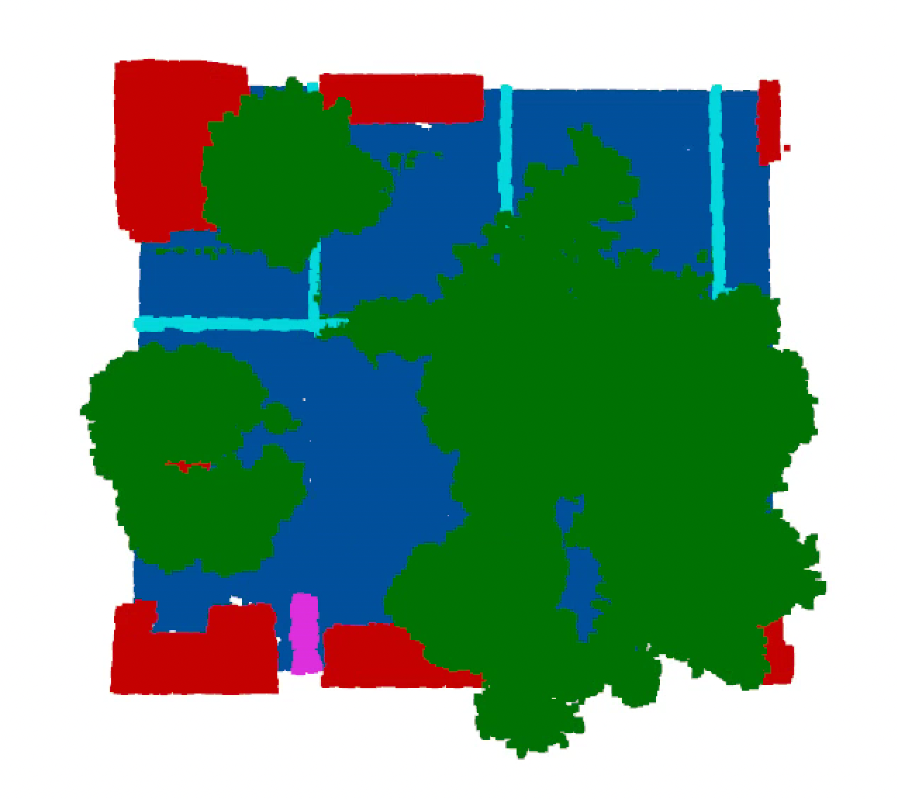


### 3.3. How to run the scripts <a name="33-how-to-run-the-scripts"></a>
We have added an argument parser to any script that we have created. The first thing to understand
how to run any script is asking for help to the parser by executing:
```bash
python3 <script_name>.py --help
```
The output will show what positional arguments, key arguments and flags the script acceps and a brief
description of what the arguments are for.

We have created the following scripts:
1. **train_segmentation.py**:
This script is used to train a model for semantic segmentation. We have used this script to train
PointNet and PointNet++ for the S3DIS and Dales datasets. The script accepts arguments as in what
model to train, what hyperparameters, etc. It is also possible to pass the arguments via a yaml file,
for example:
```yaml
batch_size: 16
dataset: dales
dataset_path: data/DALESObjects
dropout: 0.5
epoch: 100
extra_feat_dropout: 0.5
label_smoothing: 0.0
learning_rate: 0.001
mlflow_run_name: run_extra_features_more_dropout
model: pointnet_v2_sem_seg_msg
num_point: 8192
optimizer: AdamW
overlap: 0.1
partitions: 10
remove_checkpoint: true
scheduler: Cosine
test_area:
- 3
train_area:
- 1
- 2
- 4
use_cpu: false
use_extra_features: true
use_mlflow: true
weight_type: Sklearn
ens_beta: 0.99999
```
And then run the script like this:
```bash
python3 train_segmentation.py --config <path_to_the_yaml_file>.yaml
```
In any training script, if the argument use_mlflow is set to true, the script will log the metrics
in a mlflow server.

2. **train_classification.py**:
This script is used to train a model for classification. It can be run as follows (this would run
the script with the default parameters, to understand what the parameters are, run the script with --help):
```bash
python3 train_classification.py
```

Within the scripts folder, there are also scripts to run inference with the trained models, visualize
the data, etc.
3. **inference_cls.py**:
This script is used to run inference with a trained model for classification. It can be run as follows:
```bash
python3 inference_cls.py <path_to_the_model> <path_to_the_dataset> --num_points <optional_number_of_points>
```
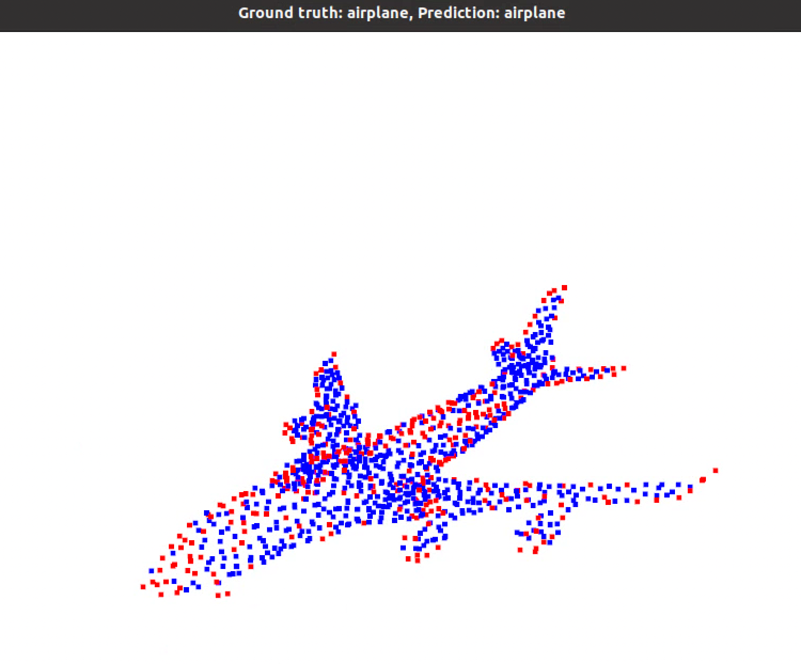

4. **inference_seg.py**:
This script is used to run inference with a trained model for semantic segmentation for the S3DIS dataset. It can be run as follows:
```bash
python3 inference_seg.py <path_to_the_model> <path_to_the_dataset> --num_points <optional_number_of_points>
```


5. **inference_dales.py**:
This script is used to£ run inference with a trained model for semantic segmentation for the Dales dataset. It can be run as follows:
```bash
python3 inference_seg.py <path_to_the_model> <path_to_the_dataset> --num_points <optional_number_of_points> --partitions <number_of_partitions> --overlap <overlap_from_0_to_1> --intensity
```
This is an example of the expected output, a point cloud where each point is colored according to the
class the model has predicted:
<p align="center">
  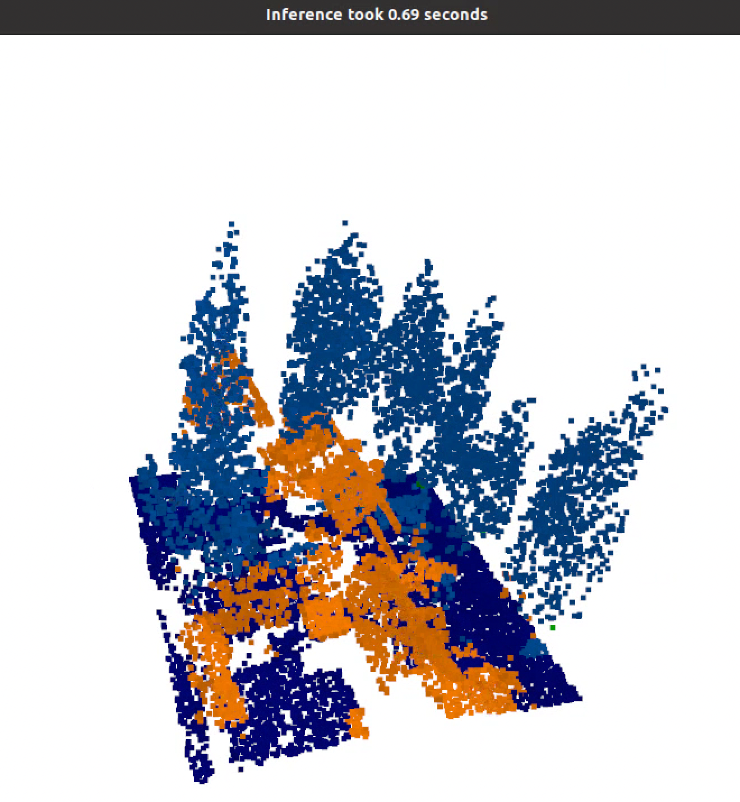
  <br>
  <em>Figure <number>: Inference with dales dataset.</em>
</p>

6. **visualize_dataset.py**:
This script is used to visualize the data of the S3DIS or DALES dataset. It can be run as follows:
```bash
python3 visualize_dataset.py <dataset_name> <path_to_the_dataset> <split_name> <index> --areas <list_of_areas_s3dis> --partitions <number_of_partitions> --overlap <overlap_from_0_to_1> --intensity 
--r_prob <r_prob>
```

### 3.4. Testing <a name="34-testing"></a>
We have implemented tests to check the functionality of the processing of the Dales dataset.
Implementing tests help us to make sure that the code is working as expected and also
to help the development of new features without breaking the old functionality.
The tests are located in the test folder. All the tests can be run with the following command:
```bash
python3 -m unittest discover -s test -p 'test_*.py' -v
```

## 4. Conclusions <a name="4-conclusions"></a>
After working with Point Cloud data, we have got the followign insights:
* Downsampling techniques are crucial for managing large datasets while preserving essential features. Many of the points of DALES for example were actually the ground, if we are able to
downsample the data in a way that it highlights the objects of interest, the performance of the
model could improve.
* Geometry-based information gathering is vital for maintaining structural relationships in point cloud data.

Also, after attempting to improve the performance of PointNet and PointNet++ in heavily unbalanced datasets, we have got the following insights:
* Addressing class imbalance is challenging but essential for robust model performance. Without
any technique to deal with the imbalance, we have seen that the models do not learn at all the
minority classes. After adding label smoothing, weighted loss, and effective number of samples,
we were able to notice a significant improvement in the model's ability to learn the minority classes.

## 5. Bibliography <a name="5-Bibliography"></a>
