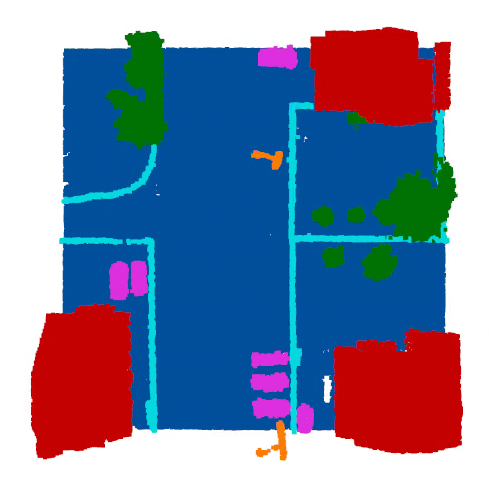

# The Point Net Suite

## Download and process datasets
* Dataset [ModelNet](https://shapenet.cs.stanford.edu/media/modelnet40_normal_resampled.zip):
```bash
wget https://shapenet.cs.stanford.edu/media/modelnet40_normal_resampled.zip --no-check-certificate
unzip modelnet40_normal_resampled.zip -d point_net_suite/data/modelnet40
rm modelnet40_normal_resampled.zip
```

* Dataset [S3DIS](http://buildingparser.stanford.edu/dataset.html): 3D indoor parsing dataset
```bash
wget https://cvg-data.inf.ethz.ch/s3dis/Stanford3dDataset_v1.2_Aligned_Version.zip
unzip Stanford3dDataset_v1.2_Aligned_Version.zip -d data/stanford_indoor3d
rm Stanford3dDataset_v1.2_Aligned_Version.zip
```
Use the script to process the areas of the dataset:
```bash
python3 point_net_suite/data_utils/s3_dis_data_gen.py <path_to_the_Area>
```

## Installation

### Option 1: pip3 venv via requirements.txt 
1. **Clone the Repository:**
    ```bash
    git clone https://github.com/jeferal/point_net_suite.git
    cd point_net_suite
    ```

2. **Install Requirements:**
    ```bash
    pip3 install -r requirements.txt
    pip3 install -e .
    ```
### Option 2: Conda Environment via yaml file

1. **Clone the Repository:**
    ```bash
    git clone https://github.com/jeferal/point_net_suite.git
    cd point_net_suite
    ```

2. **Create the Conda Environment:**
    ```bash
    conda env create -f conda_env_backup.yaml
    ```

3. **Activate the Environment:**
    ```bash
    conda activate pointnet_thesis
    ```

## Train a model
```bash
python3 point_net_suite/train_classification.py
```

```bash
python3 point_net_suite/train_segmentation.py
```

The trainings will be monitored by mlflow if
using the argument --use_mlflow.

## Inference
Classification:
```bash
python3 scripts/inference_cls.py <model_path> <dataset_path>
```


Semantic Segmentation:

```bash
python3 scripts/inference_seg.py <model_path> <dataset_path>
```

## DALES dataset
The dales dataset is composed of files with very large point clouds. These
point clouds must be partitioned into tiles so that we can use them for training.
The script `scripts/visualize_dales.py` can be used to visualize the tiles of the
point clouds. A particular partition will be stored in disk remembering the parameters N (number of partitions per side) and overlap [0,1]. If the DALES dataset
is created with the same paramters it was used before, it will use the cache. You can
run the visualization with this command:
```bash
python3 scripts/visualize_dales.py data/DALESObjects <split_name> <index> --partitions <number_of_partitions> --overlap <overlap_from_0_to_1> --intensity
```



## Test
The tests are located in the test folder. All the tests can be run with the following command:
```bash
python -m unittest discover -s test -p 'test_*.py' -v
```
