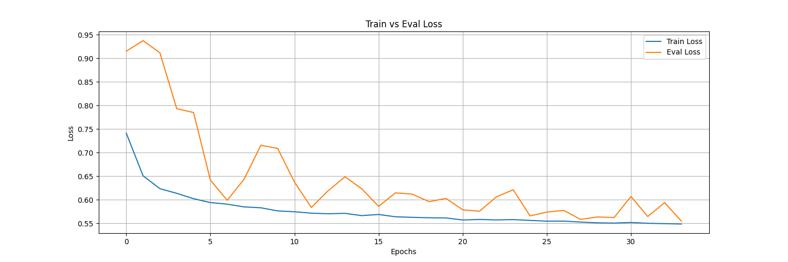
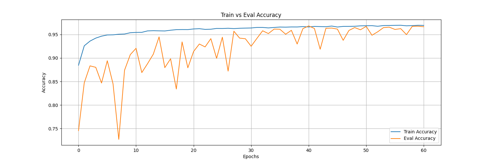

# AIDL24: Towards improving minority classes accuracy for Aerial Lidar Datasets
TBC With Mariona!!!

**Abstract here**

### About
Final project of the Postgraduate Course in Artificial Intelligence with Deep Learning. Authors:
- Sergio Calzón Molina
- Flavia Diletta Caudana
- Jesús Ferrándiz Alarcón
- Jorge Ruiz Vázquez

Supervisor:
- Mariona Carós Roca

## Table of Contents <a name="toc"></a>

- [1. Introduction](#1-intro)
    - [1.1. Motivation](#11-motivation)
    - [1.2. Milestones](#12-milestones)

- [2. Implementation](#2-Implementation)
    - [2.1. Data Preprocessing and Datasets](#21-data-preprocessing)
        - [2.1.3. Dales Dataset](#213-dales-dataset)
    - [2.2. Models](#22-models)
        - [2.2.3. PointNet](#223-pointnet)
        - [2.2.4. PointNet++](#224-pointnetpp)
    - [2.3. Sampling](#223-sampling)
    - [2.4. Experiments](#24-experiments)

- [3. Final application](#3-Final-application)
- [4. How to run the code](#4-How-to-run-the-code)
- [5. Conclusion](#5-conclusions)

- [6. Acknowledgements](#6-Acknowledgements)

## 1. Introduction <a name="1-intro"></a>

### 1.1. Motivation <a name="11-motivation"></a>

### 1.2. Milestones <a name="12-milestones"></a>

## 2. Implementation <a name="2-Implementation"></a>

### 2.1. Data Preprocessing and Datasets <a name="21-data-preprocessing"></a>

### 2.1.2. S3DIS Dataset <a name="212-s3dis-dataset"></a>
<p align="center">
  
  <br>
  <em>Figure <number>: S3DIS Dataset train distribution.</em>
</p>

### 2.1.3. Dales Dataset <a name="213-dales-dataset"></a>
The Dales Objects dataset is a Large Scale Benchmark Dataset for Segmentation and 
Instance Segmentation of Aerial Lidar data. It contains close to half-bilion hand labeled points and the dataset covers over 10 square kilometers. Each point also contains an intensity value. The dataset contains the following classes with the following number of points:

| Class Name  | Number of Points |
|-------------|------------------|
| Ground      | 246.9M           |
| Vegetation  | 159M             |
| Car         | 4.1M             |
| Truck       | 879k             |
| Powerline   | 994k             |
| Fence       | 2.1M             |
| Pole        | 262k             |
| Buildings   | 78.7M            |

If we attend to the number of points per class, we can see that the dataset is highly unbalanced. Most of the points belong to the 
classes ground and vegetation, while the classes truck, powerline, fence and pole have a very low number of points. This is a problem
that we will try to address in this project.

The dataset is divided into 2 splits: train and test. The train split contains 58 .ply files, which consist of tiles of 500 x 500 meters and the test split contains 22 .ply files.

Each tile contains around 12M points. This is a very large number of points and it is not feasible to train a model with all
the points at once. First of all, we might not have enough GPU memory to store all the points, we would have to downsample the points
heavily and we would lose a lot of information. For these reasons we decided to partition the tiles into smaller tiles.

The partitiong of the tiles also depends in an overlap parameter [0-1], which determines how much overlap there is between the tiles
to ensure that the objects are not cut. Partitioning these large point clouds takes very long CPU time. We have devided a tile into
chunks so that each core of the CPU can process a chunk in parallel and store the information in a file. This way the process takes considerably less time.

The partitioning is part of the class Dataset, where if the dataset with a certain partition parameter and overlap is not found in 
disk, then it will create it and store it in disk. Every time the client calls the method getitem, then the dataset will load from disk the file of the particular partition for the given index and will return the points and the labels.

#### Images of the partitions

### 2.2. Models <a name="22-models"></a>

#### 2.2.3. PointNet <a name="223-pointnet"></a>

<p align="center">
  
  <br>
  <em>Figure <number>: PointNet architecture.</em>
</p>

#### 2.2.4. PointNet++ <a name="224-pointnetpp"></a>

<p align="center">
  
  <br>
  <em>Figure <number>: PointNet++ architecture.</em>
</p>

### 2.3. Sampling <a name="23-sampling"></a>

### 2.4. Experiments <a name="24-Experiments"></a>

#### 2.4.1. Experiment logging <a name="241-experiment-logging"></a>
We have conducted different experiments using different models and hyperparameters. We decided to log the metrics of every 
experiment in Mlflow because it is a widely used open source application that can help us keep track of the experiments, understand
the results and better choose the hyperparameters.

The Mlflow server was running in a Google Cloud instance so that every member of the team can access to it from any machine.
In order to run the mlflow server in the Google Cloud instance, the machine needs to have docker installed. After installing docker, 
the Mlflow application can be run like this:
```bash
docker run -it --name mlflow -p <host_port>:5000 -v <mlruns_host_path>:/mlruns -v <mlartifacts_host_path>:/mlartifacts ghcr.io/mlflow/mlflow:v2.13.0 mlflow ui --host 0.0.0.0
```
To access from any other machine via http, we have to change the firewall rules of the virtual machine in Google Cloud so that the port is exposed to the internet. Further work should involve changing the security of the communication to https.

<p align="center">
  
  <br>
  <em>Figure <number>: Mlflow server.</em>
</p>

For this experiment we have logged the following metrics:

**Classification task**:
- train_loss
- eval_loss
- train_mean_accuracy
- eval_mean_accuracy
- train_per_class_loss
- eval_per_class_loss

**Segmentation task**:
- train_loss
- eval_loss
- train_accuracy
- eval_accuracy
- train_per_class_iou
- eval_per_class_iou

We have also logged **system metrics** which some of them are:
- System memory usage
- GPU memory usage
- CPU utilization percentage

And other information that is helpful for us:
- A checkpoint of the best model so far in the format .pth
- A plot with train and eval classes distribution
- The command the script was run
- The arguments the train was created with for reproducibility 

#### 2.4.2. Experiments with S3Dis PointNet semantic segmentation <a name="242-experiments-s3dis-pointnet"></a>

**Experiment PointNet with base hyper parameters:**
**Hypothesis:**
- The model should be able to learn the classes of the S3DIS dataset with the base parameters.
**Experiment Setup:**
- PointNet is trained in the S3Dis dataset.
**Results:**
<p align="center">
  
  <br>
  <em>Figure <number>: IoU by Class.</em>
</p>

**Conclusions:**
- The model is able to learn the classes that have the higher number of points. PointNet struggles
to classify points of classes with a low number of points such as class 4, 5, 9, etc. This figure and
the figure that shows the data distribution of the train data shows a correlation.

**Experiment PointNet with Weighted Loss:**
**Hypothesis:**
- The idea behing the weighted loss is to penalize more the minority classes so that the model
learns to classify them better.
**Results:**
<p align="center">
  
  <br>
  <em>Figure <number>: IoU by Class.</em>
</p>

**Conclusions:**
- With weighted loss, the plot shows that PointNet is actually learning to classify minority classes.
This is a huge improvement over the previous experiment.

#### 2.4.3. Experiments with Dales PointNet++ semantic segmentation <a name="243-experiments-dales-pointnetpp"></a>

Experiment template
**Experiment Name:**
- Params table
**Hypothesis:**
- Describe the hypothesis here.
**Experiment Setup:**
- Describe the experiment setup here.
**Results:**
- Describe the results here.
**Conclusions:**
- Describe the conclusions here.

**Experiment Base Hyper Parameters:**
| Learning Rate | Optimizer | Batch Size | Num Points | Grouping Method | Dropout | Scheduler | Label Smoothing | Extra Feature Dropout |
|---------------|-----------|------------|------------|-----------------|---------|-----------|------------------|-----------------------|
| 0.001         | AdamW     | 8          | 8192       | MSG             | 0.5     | Cosine    | 0.1              | 0.2                   |

Other parameters:
- Partitions: 20
- Overlap: 0.1
- Use extra features: true
- Weight type: None

**Hypothesis:**
- Parameters very similar to the ones used in the papers. Adding dropout to extra features to avoid overfitting to the intensity
value of the data. As in the model could learn to create a map between intensity and semantic segmentation as in any point 
that is green could be classified as vegetation. We want to avoid that and make the model pay attention to geometrical features too.

**Experiment Setup**
Experiment using PointNet++ and the Dales Dataset.

**Results:**
- We show a comparison between the train and evaluation loss, accuracy and IoU to
understand if the model is overfitting or not and how good it is performing with each class.

<div style="display: flex; justify-content: center;">
  <div style="flex: 50%; padding: 10px;">
    <p align="center">
      
      <br>
      <em>Figure <number>: Loss.</em>
    </p>
  </div>
  <div style="flex: 50%; padding: 10px;">
    <p align="center">
      
      <br>
      <em>Figure <number>: Accuracy.</em>
    </p>
  </div>
</div>

<p align="center">
  
  <br>
  <em>Figure <number>: IoU.</em>
</p>

**Conclusions:**
- The model does not seem to overfit, both train and evaluation loss are decreassing
until the steabilize. Finally, we can see that there are certain classes that the model
is not able to classify well, like class 3, 5 and 6. These classes are the ones with the
least number of points in the dataset.

**Experiment Increased Batch size and used SSG:**

| Learning Rate | Optimizer | Batch Size | Num Points | Grouping Method | Dropout | Scheduler | Label Smoothing | Extra Feature Dropout |
|---------------|-----------|------------|------------|-----------------|---------|-----------|------------------|-----------------------|
| 0.001         | AdamW     | 16          | 8192       | SSG             | 0.5     | Cosine    | 0.1              | 0.2                   |

Other parameters:
- Partitions: 20
- Overlap: 0.1
- Use extra features: true
- Weight type: None

**Hypothesis:**
- Increasing the batch size should make the train faster because we are using more data at
once. Single Scale Grouping should make the model learn worse with datasets where the density of points is not uniform.
We would like to confirm this.

**Experiment Setup**
- Experiment using PointNet++ with Single Scale Grouping training with Dales Dataset. We have implemented the training script so that
to change between SSG and MSG it is just changing a parameter.

**Results:**

<div style="display: flex; justify-content: center;">
  <div style="flex: 50%; padding: 10px;">
    <p align="center">
      
      <br>
      <em>Figure <number>: Loss.</em>
    </p>
  </div>
  <div style="flex: 50%; padding: 10px;">
    <p align="center">
      
      <br>
      <em>Figure <number>: Accuracy.</em>
    </p>
  </div>
</div>

<p align="center">
  
  <br>
  <em>Figure <number>: IoU.</em>
</p>

**Conclusions:**
- The results seem quite similar to the previous experiment. Perhaps there is not much difference between MSG and SSG for this
particular dataset or we can not appreciate the difference because of the number of points used, downsampling, etc.

**Experiment Decreased Number of Points**
| Learning Rate | Optimizer | Batch Size | Num Points | Grouping Method | Dropout | Scheduler | Label Smoothing | Extra Feature Dropout |
|---------------|-----------|------------|------------|-----------------|---------|-----------|------------------|-----------------------|
| 0.001         | AdamW     | 8          | 4096       | MSG             | 0.5     | Cosine    | 0.1              | 0.2                   |

Other parameters:
- Partitions: 20
- Overlap: 0.1
- Use extra features: true
- Weight type: None

**Hypothesis:**
- By decreasing the number of points, perhaps the model is able to pay more attention to
very small objects or very local features. However, decreasing the number of points also
means that the first random downsampling of the points will eliminate more information.
We also want to know how much this parameter affects the performance of the model.

**Experiment Setup**
- PointNet++ trained with Dales. Decreasing the number of points is changing an argument to the training script.
This will increase the downsample that we do to the raw point cloud to the one that we input to the model. This 
downsample is done with random sampling.

**Results:**

<div style="display: flex; justify-content: center;">
  <div style="flex: 50%; padding: 10px;">
    <p align="center">
      
      <br>
      <em>Figure <number>: Loss.</em>
    </p>
  </div>
  <div style="flex: 50%; padding: 10px;">
    <p align="center">
      
      <br>
      <em>Figure <number>: Accuracy.</em>
    </p>
  </div>
</div>

<p align="center">
  
  <br>
  <em>Figure <number>: IoU.</em>
</p>

**Conclusions:**
- The results seem quite similar to the previous experiment, where the model still struggles
to classify the classes with the least number of points.

**Experiment Effective Number of Samples**
| Learning Rate | Optimizer | Batch Size | Num Points | Grouping Method | Dropout | Scheduler | Label Smoothing | Extra Feature Dropout |
|---------------|-----------|------------|------------|-----------------|---------|-----------|------------------|-----------------------|
| 0.001         | AdamW     | 16          | 8192       | MSG             | 0.5     | Cosine    | 0.0              | 0.2                   |

Other parameters:
- Partitions: 20
- Overlap: 0.1
- Use extra features: true
- Weight type: EffectiveNumSamples
- ens_beta: 0.99999

**Hypothesis:**
- Effective Number of Samples is a technique to deal with unbalanced datasets. The
idea is to give more weight to the minority classes so that the model pays more
attention to them following a specific formula.

**Experiment Setup**
- We have implemented the Effective Number of Samples formula given the class balance of the dataset. This experiment is done
with the Dales dataset and PointNet++.

**Results:**

<div style="display: flex; justify-content: center;">
  <div style="flex: 50%; padding: 10px;">
    <p align="center">
      
      <br>
      <em>Figure <number>: Loss.</em>
    </p>
  </div>
  <div style="flex: 50%; padding: 10px;">
    <p align="center">
      
      <br>
      <em>Figure <number>: Accuracy.</em>
    </p>
  </div>
</div>

<p align="center">
  
  <br>
  <em>Figure <number>: IoU.</em>
</p>

**Conclusions:**
- It has taken fewer epochs for the model to start learning underrepresented classes. We can
see this in class 3 and 6 by comparing with previous experiments. However, after a while,
the results are similar to the previous experiments, but the evaluation IoU of this experiment is tending to increase, so perhaps with longer training, the results regarding
minority classes could be better.

**Experiment Weighted Loss**
| Learning Rate | Optimizer | Batch Size | Num Points | Grouping Method | Dropout | Scheduler | Label Smoothing | Extra Feature Dropout |
|---------------|-----------|------------|------------|-----------------|---------|-----------|------------------|-----------------------|
| 0.001         | AdamW     | 16          | 8192       | MSG             | 0.5     | Cosine    | 0.0              | 0.2                   |

Other parameters:
- Partitions: 20
- Overlap: 0.1
- Use extra features: true
- Weight type: Sklearn

**Hypothesis:**
- Same as the previous experiment, we expect that weighting the loss will help the model
to pay more attention to the minority classes.

**Experiment Setup**
- We have implemented the Weighted Loss using Sklearn. This experiment is done with the Dales dataset and PointNet++.

**Results:**

<div style="display: flex; justify-content: center;">
  <div style="flex: 50%; padding: 10px;">
    <p align="center">
      
      <br>
      <em>Figure <number>: Loss.</em>
    </p>
  </div>
  <div style="flex: 50%; padding: 10px;">
    <p align="center">
      
      <br>
      <em>Figure <number>: Accuracy.</em>
    </p>
  </div>
</div>

<p align="center">
  
  <br>
  <em>Figure <number>: IoU.</em>
</p>

**Conclusions:**
- The model still struggles with the minority classes and comparing this experiment with
using Effective Number of Samples, ENS seems to get better results.

**Experiment No Weighted Loss or Label Smoothing**
- With this experiment we expect to see that because the dataset is highly unbalanced, the
model will not be able to learn the minority classes well.

| Learning Rate | Optimizer | Batch Size | Num Points | Grouping Method | Dropout | Scheduler | Label Smoothing | Extra Feature Dropout |
|---------------|-----------|------------|------------|-----------------|---------|-----------|------------------|-----------------------|
| 0.001         | AdamW     | 16          | 8192       | MSG             | 0.5     | Cosine    | 0.0              | 0.2                   |

Other parameters:
- Partitions: 20
- Overlap: 0.1
- Use extra features: true
- Weight type: None

**Experiment Setup**
- This experiment is done by changing parameters of the training script. Label loss to 0 and weighted loss to None.
PointNet++ is trained with the Dales dataset.

**Hypothesis:**

**Results:**
<div style="display: flex; justify-content: center;">
  <div style="flex: 50%; padding: 10px;">
    <p align="center">
      
      <br>
      <em>Figure <number>: Loss.</em>
    </p>
  </div>
  <div style="flex: 50%; padding: 10px;">
    <p align="center">
      
      <br>
      <em>Figure <number>: Accuracy.</em>
    </p>
  </div>
</div>

<p align="center">
  
  <br>
  <em>Figure <number>: IoU.</em>
</p>

**Conclusions**
- This training stopped too early to reach a conclusion. However, comparing the first 10 epochs of this experiment with previous ones, the evaluation loss is much more unstable.

**Experiment Dense Farthest Point Sampling**
| Learning Rate | Optimizer | Batch Size | Num Points | Grouping Method | Dropout | Scheduler | Label Smoothing | Extra Feature Dropout |
|---------------|-----------|------------|------------|-----------------|---------|-----------|------------------|-----------------------|
| 0.001         | AdamW     | 16          | 8192       | MSG             | 0.5     | Cosine    | 0.1              | 0.2                   |

Other parameters:
- Partitions: 10
- Overlap: 0.1
- Use extra features: true
- Weight type: None

**Hypothesis:**
- We hypothesize that incorporating a density-related farthest point sampling algorithm into the PointNet++ architecture will enhance its ability to capture local features, resulting in improved classification accuracy for point cloud data. Specifically, we expect the density-related sampling method to better represent the geometric distribution of the points, particularly in areas with varying densities, leading to better performance on classification tasks.

**Experiment Setup**
- PointNet++ Backbone: The core network architecture will be PointNet++, which builds on PointNet by adding hierarchical feature learning and local neighborhood information.
Sampling Algorithm: We will replace the traditional farthest point sampling (FPS) algorithm with the proposed density-related farthest point sampling (DFPS) algorithm.

**Results:**
<div style="display: flex; justify-content: center;">
  <div style="flex: 50%; padding: 10px;">
    <p align="center">
      
      <br>
      <em>Figure <number>: Loss.</em>
    </p>
  </div>
  <div style="flex: 50%; padding: 10px;">
    <p align="center">
      
      <br>
      <em>Figure <number>: Accuracy.</em>
    </p>
  </div>
</div>

<p align="center">
  
  <br>
  <em>Figure <number>: IoU.</em>
</p>

**Conclusions**
- The implementation and principle of PointNet++ and proposes a density-dependent farthest point sampling algorithm by analyzing the limitations of the traditional farthest point sampling algorithm, solves them to a certain extent. However, the model seems to performe worsew will class 6. Perhaps the model needs more points.

**Experiment DFPS Increasing Number of Points**
| Learning Rate | Optimizer | Batch Size | Num Points | Grouping Method | Dropout | Scheduler | Label Smoothing | Extra Feature Dropout |
|---------------|-----------|------------|------------|-----------------|---------|-----------|------------------|-----------------------|
| 0.001         | AdamW     | 16          | 16000       | MSG             | 0.5     | Cosine    | 0.1              | 0.2                   |

Other parameters:
- Partitions: 10
- Overlap: 0.1
- Use extra features: true
- Weight type: None

**Hypothesis:**
- Increasing the number of points that we input to the model. We expect that because we
add more information to the model, it should be able to learn better.

**Experiment Setup**
- This is done just by changing the number of points parameter. By increasing the number of points, the downsample that we do to the raw point cloud is less agressive. PointNet++ is trained with the Dales Dataset. 

**Results:**
<div style="display: flex; justify-content: center;">
  <div style="flex: 50%; padding: 10px;">
    <p align="center">
      
      <br>
      <em>Figure <number>: Loss.</em>
    </p>
  </div>
  <div style="flex: 50%; padding: 10px;">
    <p align="center">
      
      <br>
      <em>Figure <number>: Accuracy.</em>
    </p>
  </div>
</div>

<p align="center">
  
  <br>
  <em>Figure <number>: IoU.</em>
</p>

**Conclusions**
- The evaluation loss and accuracy are much more stable than in the previous experiment.
Also, the model does better at learning the minority classes than in the pervious experiment. Adding more points has helped the model to learn better with DFPS. 

**Experiment More Dropout Extra Features, Weighted Loss**
| Learning Rate | Optimizer | Batch Size | Num Points | Grouping Method | Dropout | Scheduler | Label Smoothing | Extra Feature Dropout |
|---------------|-----------|------------|------------|-----------------|---------|-----------|------------------|-----------------------|
| 0.001         | AdamW     | 16          | 8192       | MSG             | 0.5     | Cosine    | 0.0              | 0.5                   |

Other parameters:
- Partitions: 10
- Overlap: 0.1
- Use extra features: true
- Weight type: Sklearn

**Hypothesis:**
- By adding more dropout to the extra features, we expect the model not to overfit to the
intensity signal of the data. Also we are using weighted loss as a last attempt to make the model learn the minority classes better.

**Experiment Setup**
- We changed the extra features dropout from 0.2 to 0.5 and we are using weighted loss. PointNet++ is trained with the Dales Dataset.
The extra features in this case is the intensity signal that the Dales dataset provides for each point. The points would have shape 4
(x,y,z, intensity).

**Results:**
<div style="display: flex; justify-content: center;">
  <div style="flex: 50%; padding: 10px;">
    <p align="center">
      
      <br>
      <em>Figure <number>: Loss.</em>
    </p>
  </div>
  <div style="flex: 50%; padding: 10px;">
    <p align="center">
      
      <br>
      <em>Figure <number>: Accuracy.</em>
    </p>
  </div>
</div>

<p align="center">
  
  <br>
  <em>Figure <number>: IoU.</em>
</p>

**Conclusions**
- The evaluation accuracy has dropped considerably compared to previous experiments. Even
compared to the one where weighted loss was used. Perhaps this amount of dropout is too
much for this model and for this dataset in particular.

**Experiment Using PointNet with Dales**
| Learning Rate | Optimizer | Batch Size | Num Points | Grouping Method | Dropout | Scheduler | Label Smoothing | Extra Feature Dropout |
|---------------|-----------|------------|------------|-----------------|---------|-----------|------------------|-----------------------|
| 0.001         | AdamW     | 16          | 8192       | MSG             | 0.5     | Cosine    | 0.0              | 0.5                   |

Other parameters:
- Partitions: 10
- Overlap: 0.1
- Use extra features: false
- Weight type: None

**Hypothesis:**
- PointNet is much worse than PointNet++ in terms of extracting local features since PointNet++ adds
the hierarchical feature extractors. We expect that PointNet reaches a lower accuracy than PointNet++
in this experiment and would like to confirm it.

**Experiment Setup**
- Model PointNet is trained with the Dales dataset.

**Results:**
<div style="display: flex; justify-content: center;">
  <div style="flex: 50%; padding: 10px;">
    <p align="center">
      
      <br>
      <em>Figure <number>: Loss.</em>
    </p>
  </div>
  <div style="flex: 50%; padding: 10px;">
    <p align="center">
      
      <br>
      <em>Figure <number>: Accuracy.</em>
    </p>
  </div>
</div>

<p align="center">
  
  <br>
  <em>Figure <number>: IoU.</em>
</p>

**Conclusions**
- Compared to the previous experiments, PoinNet reaches considerably worse evaluation loss and accuracy
as it was expected. PointNet might be reasonably good for small objects without so much noise,
but PointNet++ is much better for large scenes.

## 3. Final application <a name="3-Final-application"></a>
The Graphical User Interface

## 4. How to run the code <a name="4-How-to-run-the-code"></a>
It is mandatory to show how to run the code

## 5. Conclusions <a name="5-conclusions"></a>

## 6. Acknowledgements <a name="6-Acknowledgements"></a>


# The Point Net Suite

## Download and process datasets
* Dataset [ModelNet](https://shapenet.cs.stanford.edu/media/modelnet40_normal_resampled.zip):
```bash
wget https://shapenet.cs.stanford.edu/media/modelnet40_normal_resampled.zip --no-check-certificate
unzip modelnet40_normal_resampled.zip -d point_net_suite/data/modelnet40
rm modelnet40_normal_resampled.zip
```

* Dataset [S3DIS](http://buildingparser.stanford.edu/dataset.html): 3D indoor parsing dataset
```bash
wget https://cvg-data.inf.ethz.ch/s3dis/Stanford3dDataset_v1.2_Aligned_Version.zip
unzip Stanford3dDataset_v1.2_Aligned_Version.zip -d data/stanford_indoor3d
rm Stanford3dDataset_v1.2_Aligned_Version.zip
```
Use the script to process the areas of the dataset:
```bash
python3 point_net_suite/data_utils/s3_dis_data_gen.py <path_to_the_Area>
```

## Installation

### Option 1: pip3 venv via requirements.txt 
1. **Clone the Repository:**
    ```bash
    git clone https://github.com/jeferal/point_net_suite.git
    cd point_net_suite
    ```

2. **Install Requirements:**
    ```bash
    pip3 install -r requirements.txt
    pip3 install -e .
    ```
### Option 2: Conda Environment via yaml file

1. **Clone the Repository:**
    ```bash
    git clone https://github.com/jeferal/point_net_suite.git
    cd point_net_suite
    ```

2. **Create the Conda Environment:**
    ```bash
    conda env create -f conda_env_backup.yaml
    ```

3. **Activate the Environment:**
    ```bash
    conda activate pointnet_thesis
    ```

## Train a model
```bash
python3 point_net_suite/train_classification.py
```

```bash
python3 point_net_suite/train_segmentation.py
```

The trainings will be monitored by mlflow if
using the argument --use_mlflow.

## Inference
Classification:
```bash
python3 scripts/inference_cls.py <model_path> <dataset_path>
```


Semantic Segmentation:

```bash
python3 scripts/inference_seg.py <model_path> <dataset_path>
```

## DALES dataset
The dales dataset is composed of files with very large point clouds. These
point clouds must be partitioned into tiles so that we can use them for training.
The script `scripts/visualize_dales.py` can be used to visualize the tiles of the
point clouds. A particular partition will be stored in disk remembering the parameters N (number of partitions per side) and overlap [0,1]. If the DALES dataset
is created with the same paramters it was used before, it will use the cache. You can
run the visualization with this command:
```bash
python3 scripts/visualize_dales.py data/DALESObjects <split_name> <index> --partitions <number_of_partitions> --overlap <overlap_from_0_to_1> --intensity
```


## Test
The tests are located in the test folder. All the tests can be run with the following command:
```bash
python -m unittest discover -s test -p 'test_*.py' -v
```
